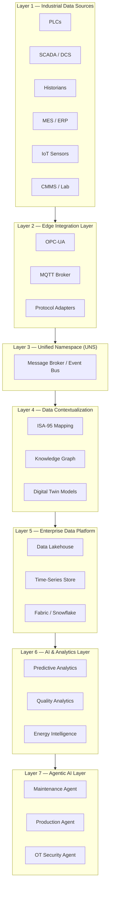

# Industrial AI Data Backbone
### *Why Enterprise Industrial AI Requires a Data Backbone, Not More Models*

[](LICENSE)
[](docs/industrial-ai-reference-architecture.md)
[](docs/isa95-contextualization-model.md)
[](docs/iec62443-security-reference.md)

---

> **"The industrial enterprises winning with AI are not the ones with the most models. They are the ones with the best data foundation."**

---

## Overview

This repository is a **practical, reusable Industrial AI Reference Architecture and Framework** for enterprise organizations deploying AI across industrial environments — manufacturing, utilities, oil & gas, energy, mining, and critical infrastructure.

It is not a software project. It is a **reference architecture** — a body of guidance, patterns, diagrams, and templates designed to accelerate the design and delivery of Industrial AI programs grounded in a scalable data foundation.

The central thesis is simple but consequential:

> Most Industrial AI initiatives fail not because the AI models are wrong — but because the data foundation is missing, fragmented, or decontextualized. The solution is an **Industrial Data Backbone**: a unified, contextual, secure, and AI-ready data fabric connecting the plant floor to enterprise intelligence.

---

## Target Audience

| Role | Relevance |
|------|-----------|
| CIO / CTO | Strategic architecture direction and investment framework |
| Industrial AI Architect | Reference patterns, integration models, and design guidance |
| OT Architect | Edge integration, protocol standards, security architecture |
| Manufacturing Leaders | Use cases, maturity model, and ROI framing |
| Utility & Energy Companies | Sector-specific use cases and architecture patterns |
| Critical Infrastructure Operators | Security-first architecture and resilience patterns |
| System Integrators | Implementation templates and integration blueprints |

---

## Industry Coverage

```
🏭 Manufacturing       ⚡ Utilities           🛢️ Oil & Gas
🔋 Energy             ⛏️ Mining              🏗️ Critical Infrastructure
```

---

## Repository Structure

```
Industrial-AI-Data-Backbone/
│
├── README.md                              ← You are here
│
├── docs/
│   ├── industrial-ai-reference-architecture.md    ← Master architecture document
│   ├── industrial-data-backbone-framework.md      ← Data Backbone framework
│   ├── unified-namespace-guide.md                 ← UNS design guide
│   ├── isa95-contextualization-model.md           ← ISA-95 data contextualization
│   ├── industrial-knowledge-graph.md              ← Knowledge graph architecture
│   ├── industrial-ai-maturity-model.md            ← AI maturity model (5 levels)
│   ├── agent-fabric-architecture.md               ← Multi-agent AI architecture
│   ├── iec62443-security-reference.md             ← OT security reference
│
├── examples/
│   ├── manufacturing-use-cases.md                 ← Manufacturing AI use cases
│   ├── utility-use-cases.md                       ← Utility sector use cases
│   └── oil-gas-use-cases.md                       ← Oil & Gas use cases
│
├── diagrams/
│   ├── edge-to-cloud-architecture.md              ← End-to-end architecture diagram
│   ├── industrial-ai-reference-architecture.md    ← Full reference architecture
│   └── agent-fabric-diagram.md                    ← Agent Fabric visual
│
└── templates/
    ├── industrial-ai-roadmap-template.md          ← Strategic roadmap template
    ├── data-platform-assessment-template.md       ← Data platform assessment
    └── industrial-ai-readiness-template.md        ← AI readiness assessment
```

---

## Core Architecture: The Industrial Data Backbone

The Industrial Data Backbone is the connective tissue between operational technology (OT) and enterprise intelligence. It consists of **seven integrated layers**:



---


---

## Industrial AI Maturity Model

```
Level 5 ████████████████████  Agentic Operations
Level 4 ████████████████      Predictive Analytics
Level 3 ████████████          Data Contextualization
Level 2 ████████              Data Integration
Level 1 ████                  Data Collection
```

→ Full model: [docs/industrial-ai-maturity-model.md](docs/industrial-ai-maturity-model.md)

---

## Key Documents

| Document | Description |
|----------|-------------|
| [Industrial AI Reference Architecture](docs/industrial-ai-reference-architecture.md) | Master architecture with all layers, components, and integration patterns |
| [Industrial Data Backbone Framework](docs/industrial-data-backbone-framework.md) | Framework for designing and implementing the data backbone |
| [Unified Namespace Guide](docs/unified-namespace-guide.md) | UNS design, broker selection, topic taxonomy, and ISA-95 alignment |
| [ISA-95 Contextualization Model](docs/isa95-contextualization-model.md) | Contextualizing OT data using ISA-95 hierarchy |
| [Industrial Knowledge Graph](docs/industrial-knowledge-graph.md) | Building a semantic knowledge layer for industrial AI |
| [AI Maturity Model](docs/industrial-ai-maturity-model.md) | Five-level framework from data collection to agentic operations |
| [Agent Fabric Architecture](docs/agent-fabric-architecture.md) | Multi-agent industrial AI systems design |
| [IEC 62443 Security Reference](docs/iec62443-security-reference.md) | OT cybersecurity architecture based on IEC 62443 |

---

## Use Cases

### 🏭 Manufacturing
- [Predictive Maintenance](examples/manufacturing-use-cases.md#predictive-maintenance)
- [Quality Analytics](examples/manufacturing-use-cases.md#quality-analytics)
- [Energy Optimization](examples/manufacturing-use-cases.md#energy-optimization)

### ⚡ Utilities
- [Leak Detection](examples/utility-use-cases.md#leak-detection)
- [Asset Health Monitoring](examples/utility-use-cases.md#asset-health-monitoring)
- [Workforce Intelligence](examples/utility-use-cases.md#workforce-intelligence)

### 🛢️ Oil & Gas
- [Production Optimization](examples/oil-gas-use-cases.md#production-optimization)
- [Integrity Management](examples/oil-gas-use-cases.md#integrity-management)
- [Predictive Inspection](examples/oil-gas-use-cases.md#predictive-inspection)

---

## Templates

| Template | Purpose |
|----------|---------|
| [Industrial AI Roadmap](templates/industrial-ai-roadmap-template.md) | 12–36 month roadmap planning template |
| [Data Platform Assessment](templates/data-platform-assessment-template.md) | Assess current data platform maturity |
| [AI Readiness Assessment](templates/industrial-ai-readiness-template.md) | Evaluate organizational readiness for Industrial AI |

---

## Guiding Principles

1. **Data before models** — No AI initiative should begin without a clear data foundation strategy.
2. **Context is everything** — Raw OT data without context is noise. Contextualization is the intelligence multiplier.
3. **Security by design** — OT/IT convergence security is not optional. IEC 62443 and Zero Trust are the baseline.
4. **Edge-first, cloud-enabled** — Processing at the edge reduces latency and bandwidth; cloud enables scale and collaboration.
5. **Standards-based** — OPC-UA, ISA-95, IEC 62443, MQTT, and Sparkplug B are the non-negotiable foundations.
6. **Human-in-the-loop** — Agentic AI in industrial environments requires human oversight, audit trails, and rollback capability.

---

## References & Further Reading

The architectural principles in this repository are informed by published industry research and practitioner experience. Key reference:

> **Dakha, S.** (2026). *Why Enterprise Industrial AI Requires a Data Backbone, Not More Models.* HCLTech / InductiveAutomation. 12 May 2026.
> — Suresh Dakha ([@dakhasuresh](https://github.com/dakhasuresh)) is a Senior Solution Architect at HCLTech specialising in Physical AI, Edge AI, and OT Cybersecurity. He holds ISA/IEC 62443 Expert certification and is an ISA Senior Member, with direct delivery experience spanning UK gas distribution, global automotive manufacturing, and industrial AI platform development.

Core arguments from this work that underpin this repository:

- Industrial AI fails not because models are weak, but because **foundations are treated as an afterthought**
- Successful pilots fail to scale due to **integration complexity**, not algorithmic limitations — what Dakha terms *"pilot purgatory"*
- Point-to-point integrations work in isolation but collapse at enterprise scale, as **integration costs grow faster than business value**
- A standardised architecture must be built on four principles: **protocol interoperability**, **Unified Namespace as a data contract**, **IEC 62443 cyber-governance from day one**, and a **layered data processing model (Bronze/Silver/Gold)**
- AI outputs in safety-critical industrial environments must be treated as **bounded recommendations with explicit human-in-the-loop fallback paths**

---

## Contributing

This is a living reference architecture. Contributions, corrections, and extensions are welcome via pull request.

Please read [CONTRIBUTING.md](CONTRIBUTING.md) before submitting changes.

---

## License

This repository is licensed under the [MIT License](LICENSE).

---

## About

This reference architecture was developed to help industrial enterprises move beyond isolated AI pilots and toward a scalable, secure, and contextualized Industrial AI foundation.

*Built for CIOs, CTOs, Industrial AI Architects, OT Architects, and the system integrators who serve them.*
