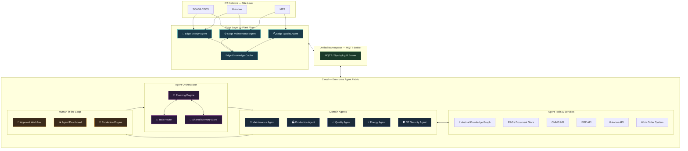
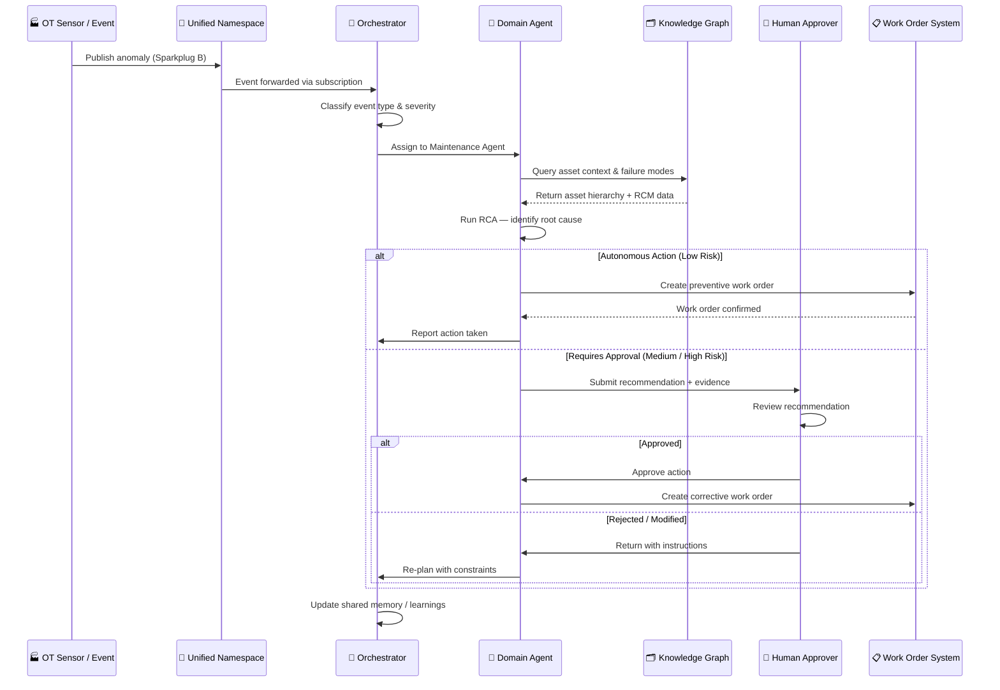
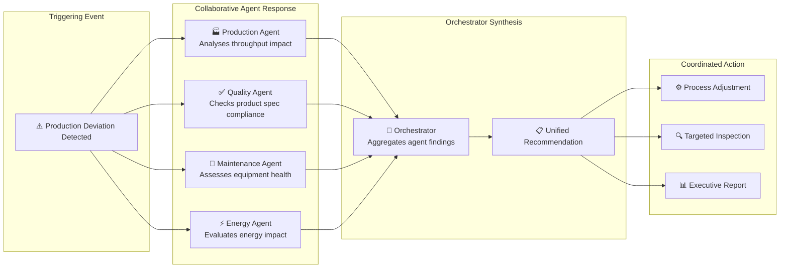
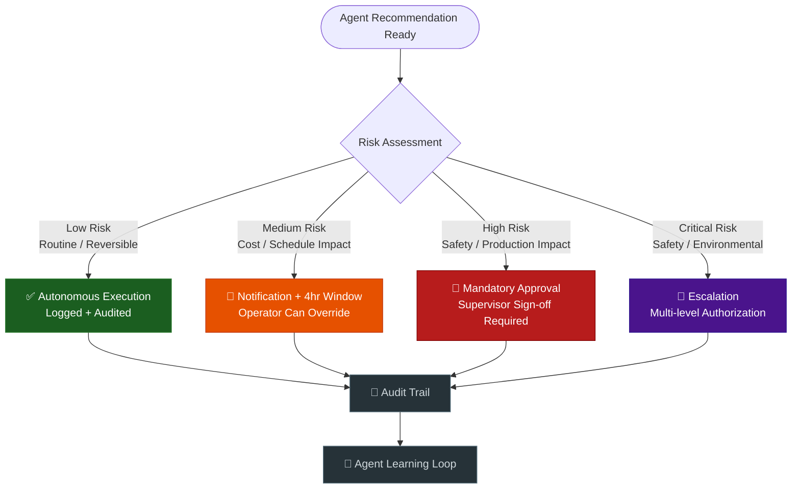
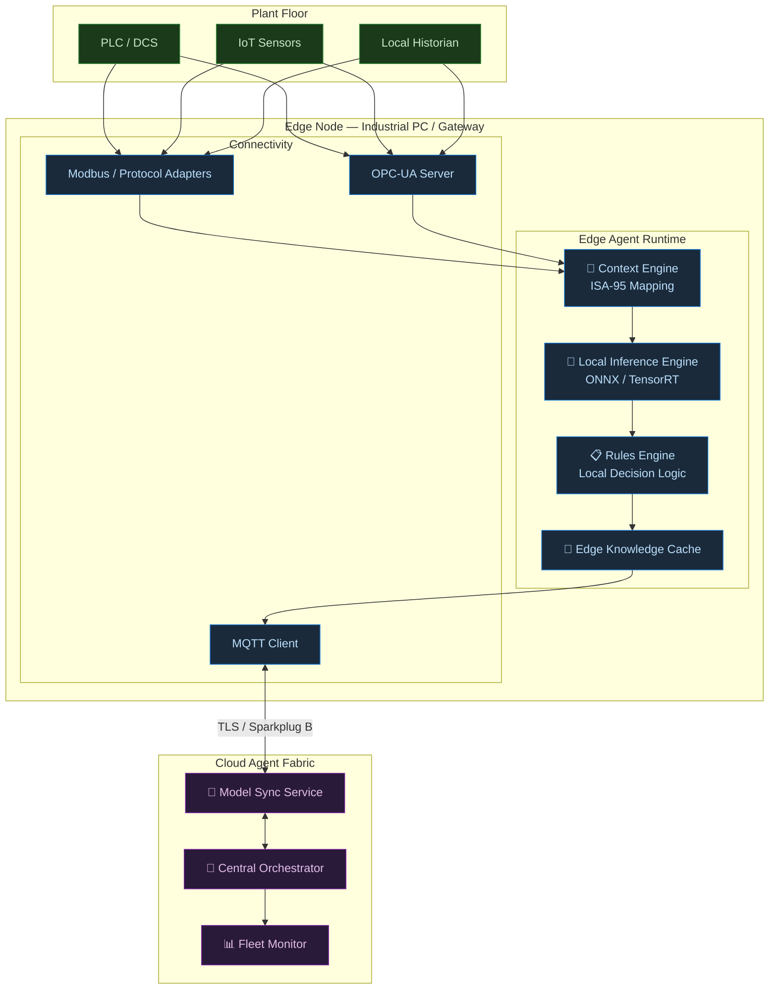
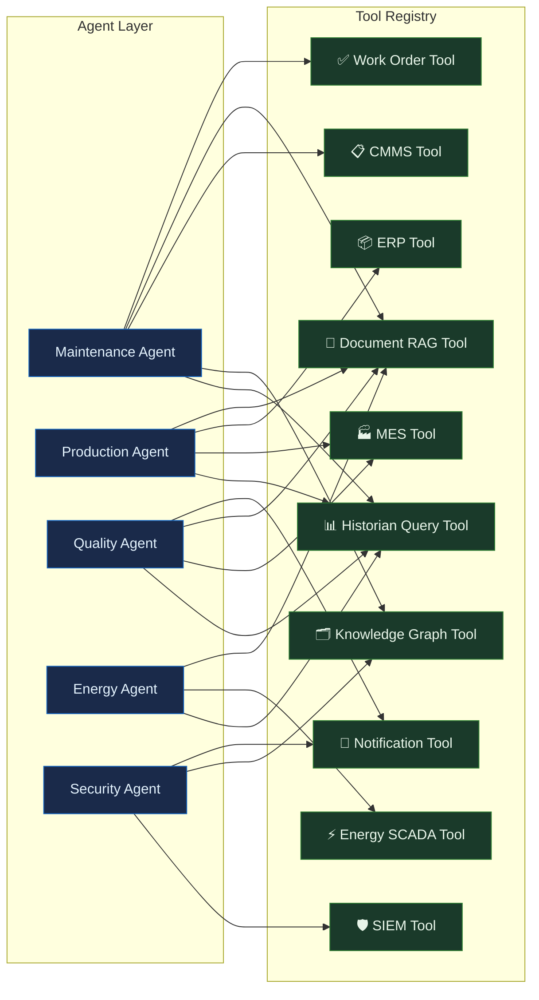
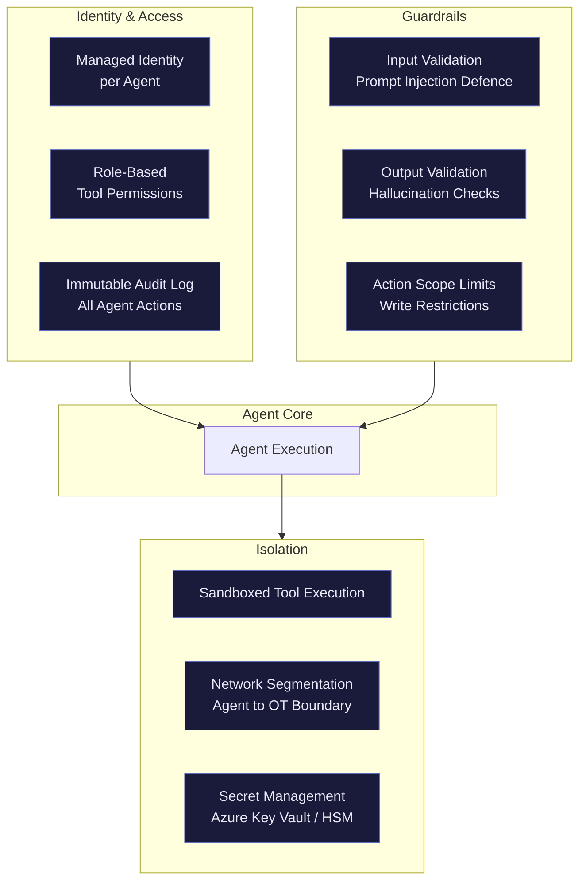

# Agent Fabric Architecture — Diagram Reference

> Visual reference for the Industrial Agent Fabric: multi-agent orchestration, human-in-the-loop workflows, and edge-to-cloud agent topology.

---

## 1. Agent Fabric — Full Topology

---

## 2. Agent Orchestration — Request Lifecycle

---

## 3. Multi-Agent Collaboration Pattern

---

## 4. Human-in-the-Loop Decision Matrix

---

## 5. Edge Agent Architecture

---

## 6. Agent Tool Integration Map

---

## 7. Agent Fabric — Technology Stack

| Layer | Component | Technology Options |
|---|---|---|
| **Orchestration** | Agent Orchestrator | LangGraph, AutoGen, CrewAI, Azure AI Foundry |
| **LLM Backend** | Foundation Model | GPT-4o, Claude 3.5, Llama 3, Mistral |
| **Edge Inference** | Local Model Runtime | ONNX Runtime, TensorRT, Ollama |
| **Memory** | Short-term Memory | Redis, in-process state |
| **Memory** | Long-term Memory | PostgreSQL + pgvector, Pinecone, Weaviate |
| **Knowledge Graph** | Graph Database | Neo4j, Amazon Neptune, Azure Cosmos DB Gremlin |
| **RAG** | Vector Store + Retrieval | Azure AI Search, FAISS, Chroma |
| **Tool Execution** | API Gateway | FastAPI, Azure API Management |
| **Human-in-the-Loop** | Approval Workflow | Power Automate, Azure Logic Apps, custom portal |
| **Observability** | Agent Monitoring | LangSmith, Arize, Azure Monitor |
| **Security** | Agent Identity | Azure Managed Identity, OAuth 2.0, mTLS |

---

## 8. Agent Fabric — Security Architecture

---

*Diagrams use Mermaid syntax — render natively on GitHub, GitLab, and in VS Code with the Mermaid Preview extension.*

*For implementation guidance, see [Agent Fabric Architecture](/docs/agent-fabric-architecture.md).*
