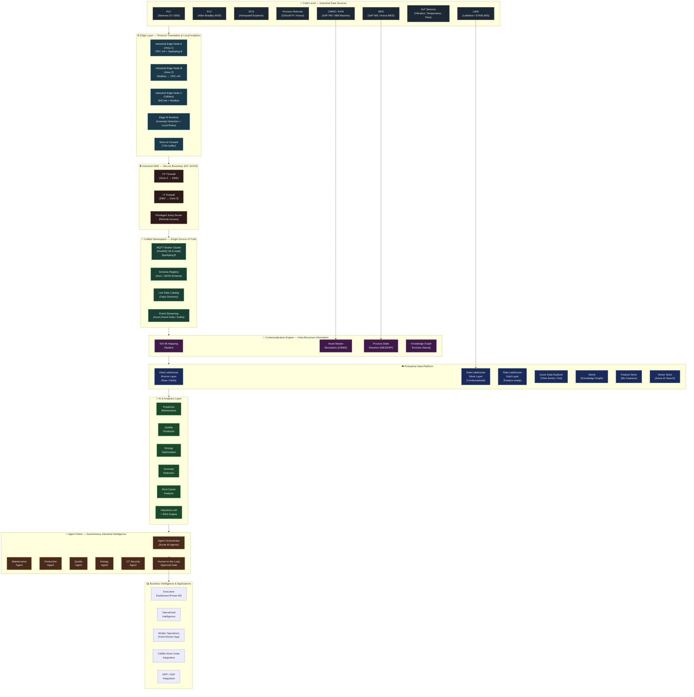
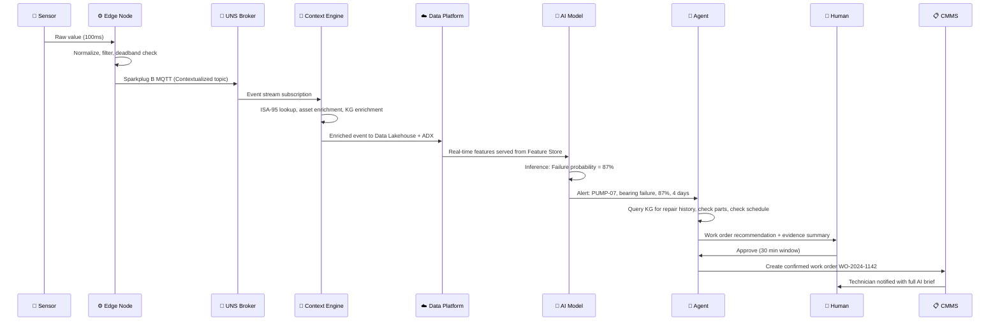
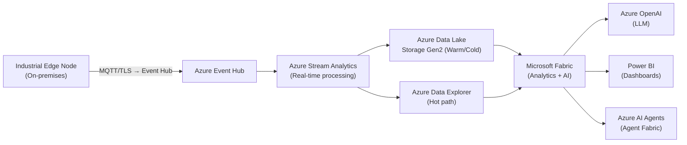
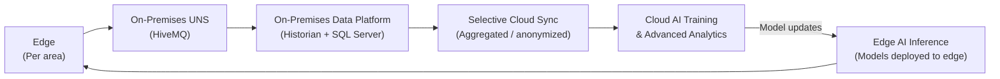

# Edge-to-Cloud Architecture Diagram

## Overview

This document provides the complete visual reference for the Industrial Edge-to-Cloud AI architecture — from field sensors to enterprise intelligence.

---

## Full Edge-to-Cloud Architecture



---

## Data Flow Diagram

End-to-end data flow from sensor reading to business action:



---

## Network Architecture Diagram

```mermaid
graph LR
    subgraph ZONE0["Zone 0 — Field Network"]
        FD["Field Devices\n(Sensors, Actuators, Drives)"]
        OT_FIELDBUS["OT Fieldbus\n(Profinet, EIP, Modbus)"]
    end

    subgraph ZONE1["Zone 1 — Control Network"]
        PLC_CLUSTER["PLC Cluster\n(per line or area)"]
        SAFETY_SYS["Safety PLC\n(SIL-rated, air-gapped)"]
        OT_LAN["OT LAN\n(Managed Layer 2)"]
    end

    subgraph ZONE2["Zone 2 — Supervisory Network"]
        SCADA_SERVER["SCADA / DCS\nServer"]
        HISTORIAN_SRV["Historian Server"]
        ENG_WS["Engineering\nWorkstation"]
        OPCUA_SRV["OPC-UA Server"]
    end

    subgraph DMZ["Industrial DMZ"]
        OT_FW["OT Firewall\n(e.g., Fortinet NGFW)"]
        JUMP_SERVER["Jump Server\n(PAM-managed)"]
        DATA_RELAY["Data Relay /\nProxy"]
        IT_FW["IT Firewall"]
    end

    subgraph ZONE3["Zone 3 — OT Supervisory / IT"]
        MQTT_BROKER["UNS Broker\n(HiveMQ)"]
        EDGE_NODES[" Edge\nNodes"]
        MES_SERVER["MES Server"]
        CMMS_SERVER["CMMS Server"]
    end

    subgraph CLOUD["Cloud / Zone 4"]
        CLOUD_PLATFORM["Azure / AWS\nCloud Platform"]
        AI_SERVICES["AI & Analytics\nServices"]
        CORP_NETWORK["Corporate\nNetwork"]
    end

    FD <-->|Fieldbus| PLC_CLUSTER
    PLC_CLUSTER <-->|OT LAN| SCADA_SERVER
    SCADA_SERVER <-->|OPC-UA| OPCUA_SRV
    OPCUA_SRV -->|Controlled| OT_FW
    OT_FW --> DATA_RELAY
    DATA_RELAY --> IT_FW
    IT_FW --> MQTT_BROKER
    MQTT_BROKER --> CLOUD_PLATFORM
    CLOUD_PLATFORM --> AI_SERVICES
    JUMP_SERVER -.->|PAM session\n(inbound only)| ZONE2

    style SAFETY_SYS fill:#7b0000,color:#fff
    style DMZ fill:#3d3d00,color:#fff
```

---

## Deployment Topology Options

### Option 1: Cloud-First (Azure)



### Option 2: On-Premises + Cloud Hybrid



---

## Related Documents

- [Industrial AI Reference Architecture](../docs/industrial-ai-reference-architecture.md)
- [Industrial AI Reference Architecture](../docs/industrial-ai-reference-architecture.md)
- [Agent Fabric Diagram](agent-fabric-diagram.md)
