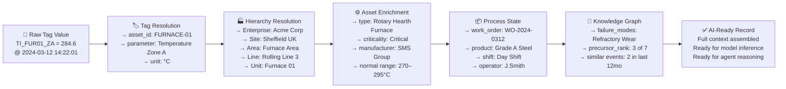
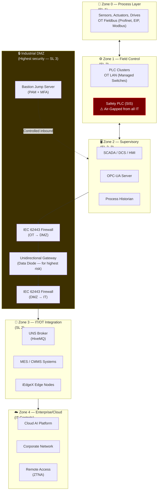
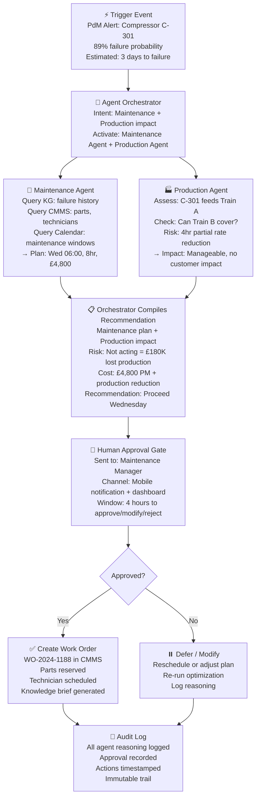
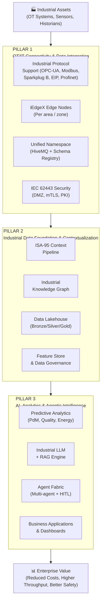

# Industrial AI Reference Architecture Diagrams

## Diagram Index

This document contains all primary architecture diagrams for the Industrial AI Reference Architecture. Each diagram is designed to be embedded in presentations, reports, and documentation.

---

## Diagram 1: Full Stack Architecture (Layers View)

```mermaid
graph TB
    subgraph LAYER7["Layer 7 — Business Value"]
        BV1["Executive Dashboards"]
        BV2["Operational Intelligence"]
        BV3["Decision Support"]
        BV4["Autonomous Actions"]
    end

    subgraph LAYER6["Layer 6 — Agentic AI"]
        AG1["Maintenance Agent"]
        AG2["Production Agent"]
        AG3["Quality Agent"]
        AG4["Energy Agent"]
        AG5["Security Agent"]
        ORCH["Orchestrator + HITL"]
    end

    subgraph LAYER5["Layer 5 — AI & Analytics"]
        AI1["Predictive Maintenance"]
        AI2["Quality Analytics"]
        AI3["Energy Optimization"]
        AI4["Root Cause Analysis"]
        AI5["Industrial LLM / RAG"]
    end

    subgraph LAYER4["Layer 4 — Enterprise Data Platform"]
        DP1["Data Lakehouse\n(Bronze/Silver/Gold)"]
        DP2["Time-Series DB\n(ADX/InfluxDB)"]
        DP3["Knowledge Graph\n(Neo4j)"]
        DP4["Feature Store"]
    end

    subgraph LAYER3["Layer 3 — Data Contextualization"]
        C1["ISA-95 Hierarchy\nMapper"]
        C2["Asset Master\nResolver"]
        C3["Process State\nResolver"]
        C4["Knowledge Graph\nEnricher"]
    end

    subgraph LAYER2["Layer 2 — Unified Namespace"]
        UNS["Industrial MQTT Broker\n(Sparkplug B)\nISA-95 Topic Taxonomy"]
    end

    subgraph LAYER1["Layer 1 — Edge Integration"]
        E1["OPC-UA\nGateway"]
        E2["Protocol\nAdapters"]
        E3["Edge AI\nNode"]
        E4["Store &\nForward"]
    end

    subgraph LAYER0["Layer 0 — Industrial Data Sources"]
        S1["PLCs / RTUs"]
        S2["SCADA / DCS"]
        S3["Historians"]
        S4["MES / ERP"]
        S5["CMMS / EAM"]
        S6["IoT Sensors"]
        S7["LIMS / Lab"]
    end

    LAYER0 --> LAYER1 --> LAYER2 --> LAYER3 --> LAYER4 --> LAYER5 --> LAYER6 --> LAYER7
```

---

## Diagram 2: Data Contextualization Flow

---

## Diagram 3: Industrial AI Maturity Progression

```mermaid
graph LR
    subgraph L1["Level 1\n📦 Data Collection"]
        l1a["Isolated systems"]
        l1b["Manual data access"]
        l1c["Excel-based analysis"]
    end

    subgraph L2["Level 2\n🔗 Data Integration"]
        l2a["Connected via UNS"]
        l2b["Real-time dashboards"]
        l2c["Basic KPI monitoring"]
    end

    subgraph L3["Level 3\n🧠 Contextualization"]
        l3a["ISA-95 hierarchy"]
        l3b["Knowledge graph"]
        l3c["Feature store live"]
    end

    subgraph L4["Level 4\n📈 Predictive Analytics"]
        l4a["PdM in production"]
        l4b["Quality AI live"]
        l4c["MLOps operational"]
    end

    subgraph L5["Level 5\n🤖 Agentic Operations"]
        l5a["Multi-agent system"]
        l5b["Autonomous actions"]
        l5c["Human-AI teaming"]
    end

    L1 -->|"OT connectivity\n& UNS deployment"| L2
    L2 -->|"ISA-95 mapping\n& knowledge graph"| L3
    L3 -->|"Feature engineering\n& ML pipeline"| L4
    L4 -->|"Agent framework\n& governance"| L5
```

---

## Diagram 4: Security Zone Architecture

---

## Diagram 5: Agent Orchestration Flow

---

## Diagram 6: iEdgeX Three-Pillar Model

---

## Related Documents

- [Edge-to-Cloud Architecture](edge-to-cloud-architecture.md)
- [Agent Fabric Diagram](agent-fabric-diagram.md)
- [Industrial AI Reference Architecture](../docs/industrial-ai-reference-architecture.md)
