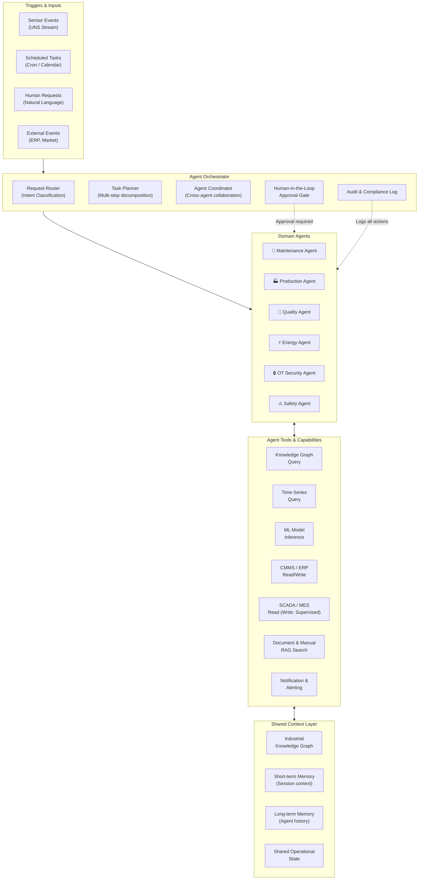
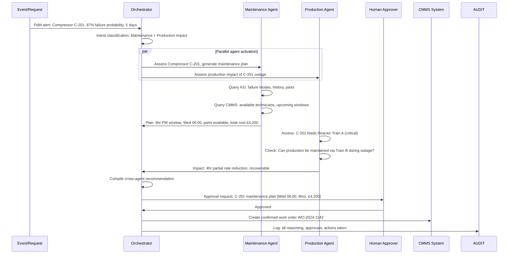
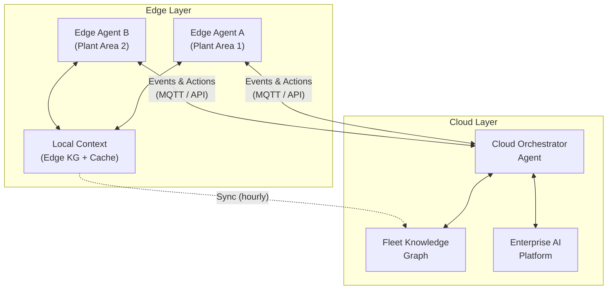
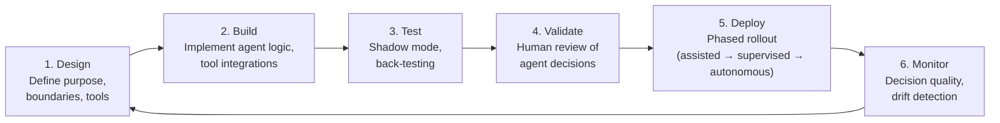

# Agent Fabric Architecture

> *Based on architectural principles by **Suresh Dakha** ([@dakhasuresh](https://github.com/dakhasuresh)), HCLTech — ISA/IEC 62443 Expert, ISA Senior Member.*

## Introduction

The Agent Fabric is the multi-agent AI layer of the Industrial Data Backbone — a structured, governed framework for deploying autonomous AI agents in industrial environments. It defines how agents are organized, how they communicate, how they are supervised, and how they safely interact with operational systems.

The term "fabric" is intentional. Like a physical fabric, the Agent Fabric is a woven structure of individual agents, each with a specific purpose, that together create a unified intelligence layer capable of acting across the full operational envelope of an industrial enterprise.

---

## Why Multi-Agent Architecture?

Industrial operations are inherently multi-domain. A refinery does not have one problem — it has simultaneous challenges in production optimization, equipment health, energy consumption, quality assurance, and safety. No single AI model can effectively reason across all these domains at once.

The multi-agent approach provides:

- **Domain specialization** — each agent is purpose-built for a specific operational domain
- **Parallel reasoning** — multiple agents can work on different problems simultaneously
- **Composable intelligence** — agents can collaborate on complex, cross-domain problems
- **Bounded autonomy** — each agent operates within defined, auditable boundaries
- **Graceful degradation** — failure of one agent does not compromise the entire AI layer

---

## Agent Fabric Architecture Diagram

---

## Agent Definitions

### Maintenance Agent

**Purpose:** Predict, plan, and coordinate maintenance activities to maximize asset reliability and minimize unplanned downtime.

```mermaid
graph LR
    subgraph INPUTS["Inputs"]
        SENSOR["Sensor anomalies\nfrom UNS"]
        PDM["PdM model\nalerts"]
        CMMS_DATA["Work order history\nfrom CMMS"]
        KG_DATA["Failure modes\nfrom Knowledge Graph"]
    end

    subgraph REASONING["Agent Reasoning (LLM + Tools)"]
        ASSESS["Assess failure\nprobability & impact"]
        PRIORITIZE["Prioritize against\nactive work orders"]
        PLAN["Generate maintenance\nplan & BOM"]
        RISK["Calculate risk of\ndeferred maintenance"]
    end

    subgraph ACTIONS["Actions"]
        CREATE_WO["Create/update\nwork order in CMMS"]
        RESERVE_PARTS["Reserve parts\nin inventory"]
        NOTIFY["Notify planner\n& technician"]
        APPROVE["Request human\napproval (if needed)"]
    end

    INPUTS --> REASONING --> ACTIONS
```

**Autonomy level:** 5b — agent creates work orders automatically; human confirms within 4 hours before scheduling execution.

**Key tools:**
- `query_knowledge_graph(asset_id)` — retrieve failure mode history
- `get_pdm_prediction(asset_id)` — retrieve current RUL and failure probability
- `create_work_order(cmms_payload)` — write to CMMS
- `check_parts_availability(part_numbers)` — check stock
- `get_technician_schedule(craft, site)` — check resource availability

---

### Production Agent

**Purpose:** Optimize production schedules, respond to unplanned events, and maximize throughput and on-time delivery.

**Trigger conditions:**
- Unplanned downtime > 15 minutes
- OEE deviation > 5% from plan
- Demand signal change from ERP
- Quality hold impacting WIP

**Autonomy level:** 5a/5b — recommendations auto-approved for schedule adjustments within ±4 hours; customer commitment changes require human approval.

---

### Quality Agent

**Purpose:** Monitor process conditions in real time to predict and prevent quality defects, and trigger corrective actions before non-conforming product is produced.

**Key capabilities:**
- Real-time SPC monitoring against control limits
- Multivariate process analysis (detect combinations of parameters that lead to defects)
- Recipe deviation detection
- Product hold recommendation with evidence chain

**Autonomy level:** 5b — product holds require supervisor approval within 30 minutes; recipe micro-adjustments within pre-approved ranges are autonomous.

---

### Energy Agent

**Purpose:** Minimize energy cost and consumption while respecting production constraints and regulatory requirements.

**Key capabilities:**
- Real-time energy demand monitoring by asset and area
- Demand response event management
- Load shifting optimization
- Peak demand prediction and pre-emptive action
- Carbon intensity optimization

**Autonomy level:** 5c — pre-approved load shedding actions (non-critical assets) are fully autonomous; grid-level demand response actions require senior approval.

---

### OT Security Agent

**Purpose:** Continuously monitor OT network behavior, detect anomalies, and recommend or take protective actions to prevent cyber incidents in industrial environments.

**Key capabilities:**
- Passive OT network traffic analysis (Purdue Model zones)
- Asset discovery and inventory reconciliation
- Anomaly detection (new assets, unexpected communications, protocol violations)
- Vulnerability identification (unpatched firmware, default credentials)
- Incident response playbook execution

**Autonomy level:** 5a/5b — recommendations for isolation of suspected compromised assets require SOC approval; logging and alerting is fully autonomous.

> **Important:** The OT Security Agent must never be configured with write access to control systems. Its intervention actions are limited to network segmentation and alerting. Physical process control remains with OT systems and human operators.

---

## Agent Orchestrator Design

The Agent Orchestrator is the central coordination component of the Agent Fabric. It is responsible for:

1. **Intent classification** — determining which agent(s) should handle a request or event
2. **Task decomposition** — breaking complex, cross-domain tasks into agent-specific sub-tasks
3. **Cross-agent coordination** — managing information sharing between collaborating agents
4. **Human-in-the-loop gates** — enforcing approval requirements before high-impact actions
5. **Audit logging** — maintaining an immutable record of all agent reasoning, decisions, and actions

### Orchestrator Workflow

---

## Human-in-the-Loop Framework

Industrial AI agents must operate within a clear human oversight model. The following framework defines when human approval is required:

### Approval Matrix

| Action Category | Risk Level | Approval Requirement | Approval Window |
|----------------|-----------|---------------------|----------------|
| Read-only analysis and recommendations | None | No approval needed | N/A |
| Work order creation (planned maintenance) | Low | Planner notification; auto-approved after 4 hours | 4 hours |
| Work order creation (emergency) | Medium | Supervisor approval required | 30 minutes |
| Recipe parameter adjustment (within range) | Low | Operator notification; auto-approved after 15 min | 15 minutes |
| Product hold recommendation | Medium | Quality Manager approval | 30 minutes |
| Emergency shutdown recommendation | Critical | Shift Manager approval; operator executes | 5 minutes |
| Network isolation (OT security) | High | SOC Lead approval | 15 minutes |
| Capital expenditure > £10,000 | High | Engineering Manager approval | 24 hours |

### Human-in-the-Loop Interface

Human approvers interact with agent recommendations through:
- **Operations dashboard** — real-time recommendation queue with evidence summaries
- **Mobile notifications** — push alerts for time-sensitive approvals
- **Natural language interface** — "Tell me more" / "Approve" / "Defer" / "Reject + reason"
- **Audit trail** — every decision recorded with approver identity and timestamp

---

## Edge Agents vs Cloud Agents

The Agent Fabric operates at two levels, each with distinct characteristics:

### Edge Agents

| Characteristic | Description |
|---------------|-------------|
| Location | Deployed on industrial edge compute nodes (per plant / area) |
| Latency | < 100ms response for real-time control-adjacent decisions |
| Connectivity | Operate during cloud connectivity loss (store-and-forward) |
| Scope | Local asset group or production area |
| Examples | Local anomaly response, edge alarm management, local energy control |

### Cloud Agents

| Characteristic | Description |
|---------------|-------------|
| Location | Deployed on cloud AI platform (Azure, AWS, GCP) |
| Latency | 1–30 seconds acceptable for planning and optimization |
| Connectivity | Always-on; enterprise-wide visibility |
| Scope | Cross-site, fleet-wide, enterprise |
| Examples | Cross-site production optimization, enterprise maintenance scheduling, carbon accounting |

### Edge-Cloud Agent Coordination

---

## Agent Security Architecture

Agents in industrial environments require a rigorous security model:

| Control | Description |
|---------|-------------|
| Least privilege | Each agent has API access only to the systems it needs |
| Action sandboxing | Agents operate in a validated action space — no arbitrary code execution |
| Action signing | All agent-initiated system writes are cryptographically signed |
| Immutable audit trail | All agent reasoning and actions logged to tamper-evident store |
| Human kill switch | Any agent can be suspended instantly by authorized personnel |
| Adversarial input detection | Agent inputs monitored for prompt injection or data poisoning |
| Separate agent identity | Each agent has its own service identity (not shared credentials) |

---

## Agent Development Lifecycle

**Shadow mode:** The agent runs in parallel with human decisions for 30–90 days, its recommendations logged and compared to actual human decisions. Agreement rate and accuracy are measured before live deployment.

---

## Agent Fabric Technology Stack

| Component | Recommended Technology | Purpose |
|-----------|----------------------|---------|
| Agent runtime | LangChain / LlamaIndex / AutoGen | Agent reasoning framework |
| LLM | Azure OpenAI (GPT-4o) | Language reasoning |
| Orchestration | Azure AI Agents / CrewAI | Multi-agent coordination |
| Short-term memory | Redis | Session and working memory |
| Long-term memory | PostgreSQL + pgvector | Agent history and learned patterns |
| Knowledge graph | Neo4j | Industrial KG access |
| Tool APIs | FastAPI + OpenAPI | Standardized tool interfaces |
| Audit log | Azure Monitor / Elasticsearch | Immutable action logging |
| Approval workflow | ServiceNow / Power Automate | Human-in-the-loop UI |

---

## Related Documents

- [Industrial Knowledge Graph](industrial-knowledge-graph.md)
- [Industrial AI Maturity Model](industrial-ai-maturity-model.md)
- [Industrial AI Reference Architecture](industrial-ai-reference-architecture.md)
- [IEC 62443 Security Reference](iec62443-security-reference.md)
