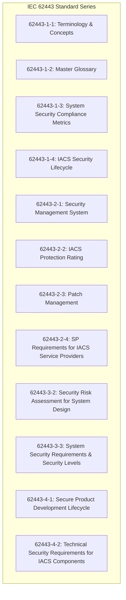
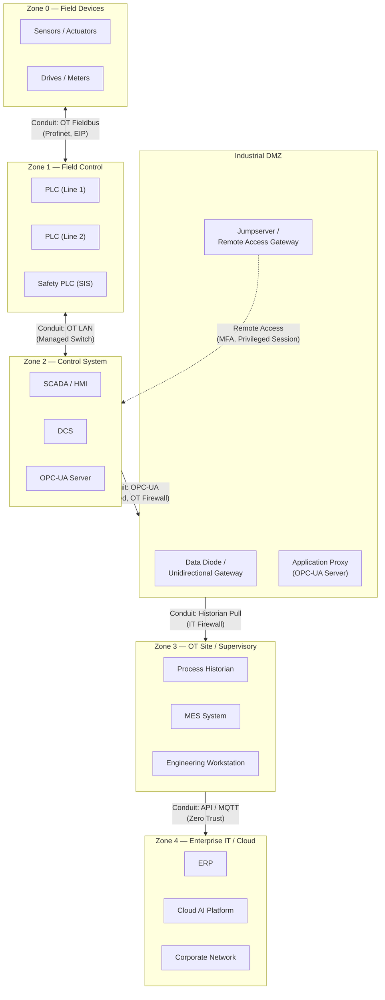
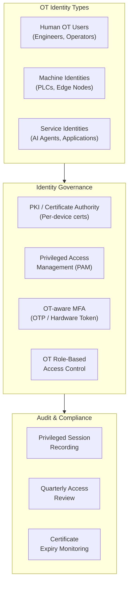
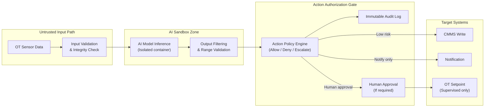
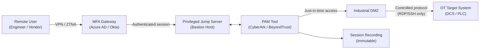
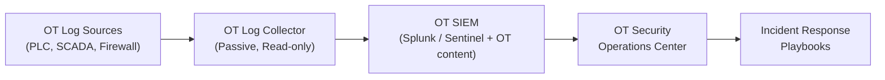

# IEC 62443 OT Cybersecurity Reference Architecture

> *Based on architectural principles by **Suresh Dakha** ([@dakhasuresh](https://github.com/dakhasuresh)), HCLTech — ISA/IEC 62443 Expert, ISA Senior Member.*

## Overview

IEC 62443 is the international standard for cybersecurity in industrial automation and control systems (IACS). It provides a risk-based framework for securing operational technology environments — PLCs, SCADA, DCS, and the networks that connect them.

For Industrial AI deployments, IEC 62443 is not optional. Connecting OT systems to AI platforms increases the attack surface of industrial environments. Every integration point between OT and IT must be designed with IEC 62443 principles from the outset.

---

## IEC 62443 Structure

The standards most directly applicable to Industrial AI architecture are:
- **62443-3-2** — Risk assessment methodology (zone and conduit model)
- **62443-3-3** — Security levels (SL 1–4) and system requirements
- **62443-4-1** — Secure development lifecycle (for AI systems built for industrial use)

---

## Zone and Conduit Model

The foundation of IEC 62443 architecture is the Zone and Conduit model. A **zone** is a logical or physical grouping of assets with a common security requirement. A **conduit** is a controlled communication path between zones.

---

## Security Level Framework

IEC 62443-3-3 defines four Security Levels (SL) that describe the capability required to resist attack by adversaries of increasing sophistication:

| Security Level | Threat Actor | Requirements |
|---------------|-------------|-------------|
| **SL 1** | Casual or unintentional violation | Basic security hygiene — default password changes, patching |
| **SL 2** | Intentional violation using simple means | Authentication, authorization, encrypted communications |
| **SL 3** | Intentional violation using sophisticated means | MFA, anomaly detection, integrity monitoring, segmentation |
| **SL 4** | State-sponsored, nation-state level attack | Highest assurance — specialized for critical national infrastructure |

### Recommended Security Levels by Zone

| Zone | Zone Description | Recommended SL | Rationale |
|------|-----------------|---------------|-----------|
| Zone 0 | Field devices | SL 1 | Legacy devices, limited capability |
| Zone 1 | Field control | SL 2 | Modern PLCs should support SL 2 |
| Zone 2 | Control system | SL 2–3 | Core OT systems; SL 3 for critical infrastructure |
| Industrial DMZ | DMZ | SL 3 | Highest exposure point; must be robust |
| Zone 3 | OT supervisory | SL 2 | Connected to both OT and IT |
| Zone 4 | Enterprise / Cloud | SL 2 (IT controls) | Standard IT security framework |
| Safety Systems | SIS | SL 3–4 | Safety instrumented systems are critical |

---

## Zero Trust for OT Environments

Zero Trust in OT is not identical to IT Zero Trust. The consequences of incorrect authorization in an OT environment can be physical — damaged equipment, process disruptions, or safety incidents. The following principles define an OT-appropriate Zero Trust model:

### Zero Trust Principles Adapted for OT

| Principle | IT Application | OT Adaptation |
|-----------|--------------|--------------|
| Verify explicitly | Authenticate every user/device | Every device has a unique identity; mTLS on all OT communications |
| Least privilege | Minimum permissions per role | Read-only by default for all IT connections to OT; writes require explicit approval per tag |
| Assume breach | Continuous monitoring | OT network traffic monitored for anomalies; assume adversary may already be in IT |
| Micro-segmentation | Network segments per application | Zones per IEC 62443; each PLC group in its own network segment |

### OT Identity Model

---

## Industrial AI Security Considerations

### AI-Specific OT Security Risks

| Risk | Description | Mitigation |
|------|-------------|-----------|
| Data poisoning | Adversary injects false sensor data to corrupt AI models | Data integrity checks; anomaly detection on training data |
| Model inversion | Adversary extracts process IP from AI model behavior | Model output obfuscation; access control on model APIs |
| Adversarial inputs | Manipulated sensor values cause incorrect AI recommendations | Input validation; adversarial training |
| Agent exploitation | Malicious instructions injected into agent reasoning | Agent sandboxing; input sanitization; human approval gates |
| Over-reliance on AI | Operators disable manual overrides based on AI trust | Mandatory human-in-the-loop for safety-critical decisions |
| Supply chain | Compromised AI model or library deployed to OT edge | Code signing; model provenance tracking; SBOM |

### Secure AI Deployment Pattern

---

## Remote Access Architecture

Secure remote access to OT environments is one of the highest-risk areas in industrial cybersecurity. The following architecture is recommended:

**Requirements:**
- No direct VPN to OT network — always via jump server
- MFA required for all remote access to OT
- Just-in-time (JIT) access with approval workflow
- Full session recording for all OT remote access
- Vendor access strictly time-limited and revoked immediately after task

---

## Patch Management for OT

OT patching is fundamentally different from IT patching. Production systems cannot be patched on the same schedule as enterprise IT without impacting operations.

### OT Patch Management Framework

| Priority | Vulnerability Type | Maximum Patch Window | Mitigation if Patch Delayed |
|----------|--------------------|---------------------|----------------------------|
| Critical | CVSS 9.0–10.0; remote code execution | 72 hours (with compensating controls) | Isolate affected system; increase monitoring |
| High | CVSS 7.0–8.9; exploitable remotely | Next planned maintenance window (< 30 days) | Firewall rule tightening; disable unused services |
| Medium | CVSS 4.0–6.9 | Quarterly patch cycle | Document and accept risk |
| Low | CVSS < 4.0 | Annual cycle | Accept risk |

**Key principle:** Unpatched OT systems are normal. The response to unpatched OT is compensating controls (network segmentation, monitoring), not emergency patching that could destabilize production systems.

---

## OT Security Monitoring

### What to Monitor in OT Environments

| Data Source | What to Collect | Detection Value |
|------------|-----------------|----------------|
| OT network traffic | NetFlow, SPAN/TAP traffic | Anomalous communications, new assets, lateral movement |
| PLC event logs | Program changes, login events | Unauthorized configuration changes |
| SCADA audit logs | User actions, setpoint changes | Insider threat, unauthorized operation |
| Historian data | Tag value behavior | Process anomalies, data manipulation |
| Firewall logs | DMZ traffic | Unauthorized access attempts, data exfiltration |
| Edge node logs | Agent actions, connectivity events | Edge compromise, agent anomaly |

### OT SIEM Integration

**Important:** OT security monitoring is passive. Collectors must never send traffic back to OT systems. Use SPAN ports, TAPs, or syslog forwarding — never agent-based collection on PLCs or DCS controllers.

---

## IEC 62443 Compliance Checklist

### Zone and Conduit Design

- [ ] Security zones defined and documented for all OT areas
- [ ] Zone risk assessment completed per 62443-3-2
- [ ] Security levels assigned to all zones
- [ ] All conduits between zones documented with allowed protocols
- [ ] Industrial DMZ deployed between OT Zone 3 and IT Zone 4
- [ ] Data diode or unidirectional gateway for highest-risk conduits

### Access Control

- [ ] Unique identities for all OT users (no shared accounts)
- [ ] OT role-based access control implemented
- [ ] MFA for all remote OT access
- [ ] Privileged Access Management (PAM) deployed for OT
- [ ] Vendor access process documented and enforced

### Network Security

- [ ] OT network segmented from IT (no flat network)
- [ ] OT firewall rules documented and reviewed quarterly
- [ ] Wireless OT networks isolated and encrypted (WPA3)
- [ ] OT asset inventory complete and maintained

### Monitoring & Response

- [ ] OT network monitoring deployed (passive)
- [ ] OT SIEM with industrial-specific use cases
- [ ] OT incident response plan documented and exercised
- [ ] Vulnerability management process for OT assets

### Lifecycle

- [ ] OT security incorporated in change management process
- [ ] New integrations (including AI integrations) reviewed by OT security
- [ ] OT security training for engineers and operators
- [ ] Annual IEC 62443 compliance review

---

## Related Documents

- [Industrial AI Reference Architecture](industrial-ai-reference-architecture.md)
- [iEdgeX Reference Architecture](iedgex-reference-architecture.md)
- [Agent Fabric Architecture](agent-fabric-architecture.md)
