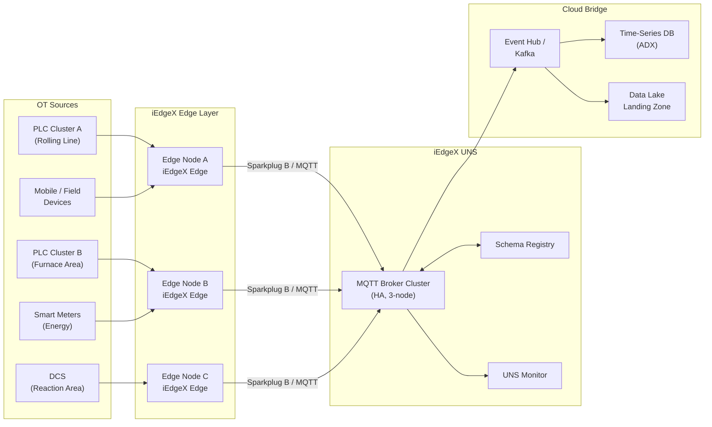
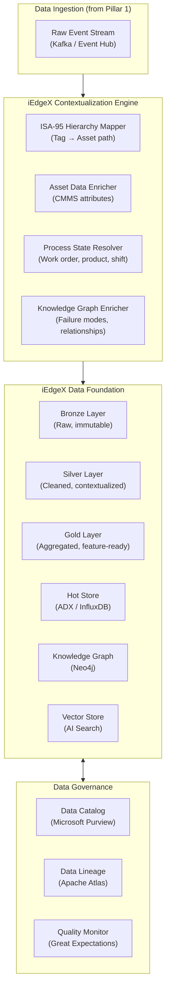
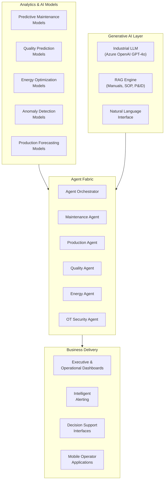
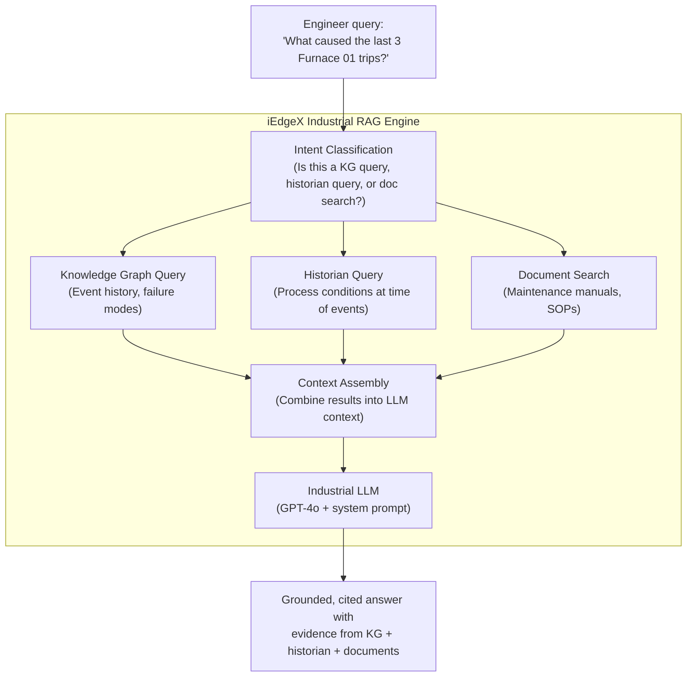
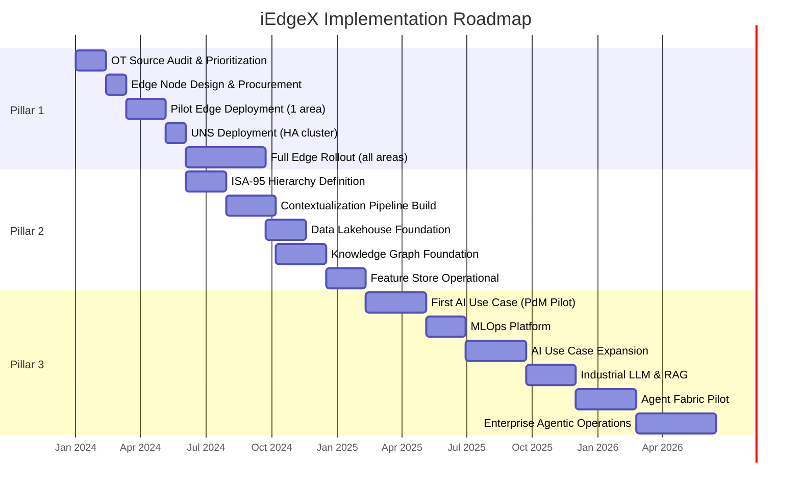

# iEdgeX Reference Architecture

> *Based on architectural principles by **Suresh Dakha** ([@dakhasuresh](https://github.com/dakhasuresh)), HCLTech — ISA/IEC 62443 Expert, ISA Senior Member.*

## What Is iEdgeX?

**iEdgeX** is a unified Edge-to-Cloud Industrial AI Backbone — a purpose-designed reference architecture that provides a complete, opinionated blueprint for connecting industrial operations from the field device to enterprise intelligence.

iEdgeX is built on three foundational pillars that must be implemented in sequence. Each pillar is a prerequisite for the next. Organizations that attempt to implement Pillar 3 without Pillars 1 and 2 in place will encounter the same data quality, integration, and context failures that plague most Industrial AI programs.

---

## iEdgeX Architecture Overview

```mermaid
graph TB
    subgraph FIELD["🏭 Industrial Field Environment"]
        PLC["PLCs / RTUs\n(Siemens, Rockwell, Schneider)"]
        DCS["DCS\n(Honeywell, ABB, Emerson)"]
        SENSORS["IIoT Sensors\n(Vibration, Temperature, Flow)"]
        MES_LOCAL["MES / LIMS\n(SAP ME, Aveva)"]
    end

    subgraph P1["━━━━━━━━━━━━━━━━━━━━━━━━━━━━━━━━━━━━━\nPILLAR 1: OT/IT Connectivity & Data Integration\n━━━━━━━━━━━━━━━━━━━━━━━━━━━━━━━━━━━━━"]
        OPCUA_GW["OPC-UA Gateway\n(per area)"]
        MQTT_EDGE["MQTT Edge Node\n(Sparkplug B)"]
        PROTO_ADAPT["Protocol Adapters\n(Modbus, EIP, Profinet)"]
        UNS["Unified Namespace\n(Industrial MQTT Broker)"]
        OT_SEC["IEC 62443\nSecurity Fabric"]
    end

    subgraph P2["━━━━━━━━━━━━━━━━━━━━━━━━━━━━━━━━━━━━━\nPILLAR 2: Industrial Data Foundation & Contextualization\n━━━━━━━━━━━━━━━━━━━━━━━━━━━━━━━━━━━━━"]
        ISA95_CTX["ISA-95 Contextualization\nPipeline"]
        KNOWLEDGE_G["Industrial Knowledge\nGraph"]
        DATA_LAKEHOUSE["Industrial Data Lakehouse\n(Bronze / Silver / Gold)"]
        FEAT_STORE["Feature Store\n(AI-Ready Features)"]
        DATA_GOV["Data Governance\n(Catalog + Lineage + Quality)"]
    end

    subgraph P3["━━━━━━━━━━━━━━━━━━━━━━━━━━━━━━━━━━━━━\nPILLAR 3: AI, Analytics & Agentic Intelligence\n━━━━━━━━━━━━━━━━━━━━━━━━━━━━━━━━━━━━━"]
        PRED_AI["Predictive Analytics\n(PdM, Quality, Energy)"]
        GEN_AI["Generative AI\n(Industrial LLM + RAG)"]
        AGENT_FABRIC["Agent Fabric\n(Multi-agent Orchestration)"]
        HITL["Human-in-the-Loop\nApproval Workflows"]
        BIZ_APPS["Business Applications\n(Dashboards, DSS, Alerts)"]
    end

    FIELD --> P1 --> P2 --> P3
```



---

## Pillar 1: OT/IT Connectivity & Data Integration

### Purpose

Pillar 1 establishes reliable, secure, and standards-based connectivity between every operational data source and the enterprise. Without Pillar 1, there is no data. Without data, there is no AI.

### Core Components



### iEdgeX Edge Node Specification

The iEdgeX Edge Node is the field-deployed compute unit that provides protocol translation, data normalization, local analytics, and secure northbound communication.

| Capability | Description |
|-----------|-------------|
| Protocol support | OPC-UA, Modbus TCP/RTU, EtherNet/IP, Profinet, BACnet, IEC 61850, DNP3 |
| Data normalization | Engineering unit conversion, deadband filtering, RLE compression |
| Local analytics | Real-time anomaly detection, rule-based alerting, local historian cache |
| Northbound communication | Sparkplug B over MQTT/TLS 1.3 |
| Store-and-forward | 72-hour local buffer for network interruptions |
| Security | mTLS, TPM-based device attestation, secure boot |
| Management | Remote configuration, OTA updates, health monitoring |
| Form factor | Industrial DIN-rail (IP20) or ruggedized enclosure (IP65) for field deployment |

### Pillar 1 Technology Stack

| Component | Recommended Technology | Alternative |
|-----------|----------------------|-------------|
| Edge runtime | AWS Greengrass / Azure IoT Edge | K3s on industrial PC |
| OPC-UA client | Prosys OPC / Kepware | Node-RED + node-opcua |
| MQTT broker | HiveMQ Enterprise | EMQX |
| Protocol adapter | Cogent DataHub / Kepware | Custom adapters |
| Edge compute hardware | Moxa UC-8100 / Advantech ARK | Siemens IPC |
| Sparkplug B library | Eclipse Tahu | Cirrus Link modules |

### Pillar 1 Security Requirements

- All MQTT connections over TLS 1.3
- Per-device mTLS certificates (not shared)
- PKI infrastructure with automated certificate renewal
- OT/IT DMZ with industrial firewall
- IEC 62443 Zone 1–3 segmentation
- No IT protocols (HTTP, SMB, RDP) in OT zones

---

## Pillar 2: Industrial Data Foundation & Contextualization

### Purpose

Pillar 2 transforms the connected data stream from Pillar 1 into an AI-ready information foundation. Raw tag values become contextual records with asset identity, operational state, quality history, and failure mode relationships.

### Core Components



### ISA-95 Contextualization Pipeline

The iEdgeX Contextualization Engine processes every incoming event through a five-stage enrichment pipeline:

| Stage | Input | Process | Output |
|-------|-------|---------|--------|
| 1. Tag Resolution | `{tag: 'TI_FUR01', value: 284.6}` | Map tag to ISA-95 path via tag registry | + `isa95_path`, `asset_id` |
| 2. Asset Enrichment | `asset_id: 'FURNACE-01'` | Retrieve asset attributes from CMMS | + `asset_class`, `criticality`, `manufacturer` |
| 3. Process State | `asset_id + timestamp` | Link to active work order, product, shift | + `work_order`, `product`, `shift`, `operator` |
| 4. Parameter Enrichment | `parameter_id` | Retrieve limits, units, normal ranges | + `unit`, `alarm_limits`, `normal_range` |
| 5. KG Enrichment | `asset_id + parameter` | Retrieve failure mode candidates | + `failure_mode_candidates`, `precursor_rank` |

### Data Lakehouse Architecture (iEdgeX)

```mermaid
graph LR
    subgraph BRONZE["Bronze (Raw)"]
        B1["Raw time-series\n(Parquet + Delta)"]
        B2["Raw events\n(JSON + Delta)"]
        B3["Source system\nextract files"]
    end

    subgraph SILVER["Silver (Contextualized)"]
        S1["Contextualized\ntime-series"]
        S2["Asset-aligned\noperational data"]
        S3["Normalized\nevent data"]
        S4["Quality records"]
    end

    subgraph GOLD["Gold (Analytics-Ready)"]
        G1["ML Feature Store"]
        G2["KPI aggregates"]
        G3["Failure event dataset"]
        G4["Energy profiles"]
    end

    BRONZE -->|"Contextualization\npipeline"| SILVER
    SILVER -->|"Aggregation &\nfeature engineering"| GOLD
```



### Pillar 2 Technology Stack

| Component | Recommended Technology | Alternative |
|-----------|----------------------|-------------|
| Data lakehouse | Microsoft Fabric / Databricks | Apache Iceberg + Spark |
| Time-series DB | Azure Data Explorer (Kusto) | InfluxDB Enterprise |
| Stream processing | Azure Stream Analytics / Flink | Apache Kafka Streams |
| Knowledge graph | Neo4j | Azure Cosmos DB (Gremlin) |
| Feature store | Microsoft Fabric Feature Store | Feast |
| Data catalog | Microsoft Purview | Apache Atlas / Collibra |
| Data quality | Microsoft Fabric DQ / Great Expectations | dbt tests |

---

## Pillar 3: AI, Analytics & Agentic Intelligence

### Purpose

Pillar 3 is the intelligence layer — where the high-quality, contextual data from Pillars 1 and 2 is transformed into predictions, recommendations, and autonomous actions that drive operational and business outcomes.

### Core Components



### AI Model Portfolio (Pillar 3)

#### Predictive Maintenance

```mermaid
graph LR
    subgraph INPUTS["Feature Inputs"]
        VIBE["Vibration RMS\n(time-series features)"]
        TEMP["Temperature\n(trend features)"]
        CURR["Motor current\n(load features)"]
        MAINT_HIST["Maintenance history\n(KG features)"]
        RUNTIME["Runtime hours\n(age features)"]
    end

    subgraph MODEL["PdM Model Stack"]
        FEAT_ENG["Feature Engineering\n(rolling stats, FFT, wavelets)"]
        RUL["RUL Model\n(Survival / LSTM)"]
        ANOMALY["Anomaly Model\n(Autoencoder)"]
        ENSEMBLE["Ensemble\n(Failure probability)"]
    end

    subgraph OUTPUTS["Model Outputs"]
        PROB["Failure probability\n(0–100%)"]
        RUL_DAYS["Remaining useful life\n(days)"]
        FAILURE_TYPE["Failure type\n(bearing, seal, rotor)"]
        URGENCY["Recommended action\n(monitor / plan / urgent)"]
    end

    INPUTS --> MODEL --> OUTPUTS
```



### Generative AI in Industrial Operations

iEdgeX Pillar 3 includes a Generative AI layer that provides natural language interaction with industrial systems and documents. This is not a replacement for structured analytics — it is a powerful complement for human operators and engineers who need to interrogate systems in natural language.

**Industrial RAG Architecture:**



### Pillar 3 Technology Stack

| Component | Recommended Technology | Alternative |
|-----------|----------------------|-------------|
| AI/ML platform | Azure Machine Learning | Databricks ML |
| Model serving (cloud) | Azure ML Online Endpoints | Seldon / BentoML |
| Model serving (edge) | ONNX Runtime on edge node | TensorFlow Lite |
| LLM | Azure OpenAI (GPT-4o) | Llama 3 (self-hosted) |
| RAG framework | LangChain + Azure AI Search | LlamaIndex |
| Agent framework | Azure AI Agents / AutoGen | LangGraph |
| Dashboards | Microsoft Power BI / Fabric | Grafana |
| Alerting | Azure Monitor / PagerDuty | OpsGenie |

---

## iEdgeX Deployment Models

### Model A: Single-Site Deployment

Suitable for a single manufacturing site or facility.

```
Field Devices → iEdgeX Edge Nodes (per area) → On-premises UNS → Site Data Platform → Cloud AI
```

### Model B: Multi-Site Enterprise Deployment

Suitable for enterprises with multiple plants or facilities.

```
Site A Edge → Site A UNS → Site A Data Platform ─┐
Site B Edge → Site B UNS → Site B Data Platform  ├→ Enterprise Data Hub → Enterprise AI
Site C Edge → Site C UNS → Site C Data Platform ─┘
```

### Model C: Utility / Distributed Infrastructure Deployment

Suitable for utilities, pipelines, and geographically distributed assets.

```
Field RTUs (distributed) → Regional Edge Aggregators → Central OT Platform → AI Command Center
```

---

## iEdgeX Key Performance Indicators

### Pillar 1 (Connectivity)

| KPI | Target | Measurement |
|-----|--------|-------------|
| OT data source coverage | > 90% of priority assets connected | Monthly audit |
| Data latency (OT to UNS) | < 5 seconds | UNS monitoring |
| UNS availability | > 99.9% | SLA monitoring |
| Edge node uptime | > 99.5% | Edge fleet management |

### Pillar 2 (Foundation)

| KPI | Target | Measurement |
|-----|--------|-------------|
| Tag contextualization rate | > 95% of AI-relevant tags | Data catalog |
| Data quality score | > 95% (completeness, accuracy, timeliness) | Quality monitoring |
| Knowledge graph coverage | > 90% of critical assets with failure modes | KG audit |
| Feature store freshness | < 60 seconds for real-time features | Feature monitoring |

### Pillar 3 (Intelligence)

| KPI | Target | Measurement |
|-----|--------|-------------|
| PdM model precision | > 85% | Monthly model evaluation |
| Average warning lead time | > 14 days | Incident analysis |
| AI recommendation acceptance rate | > 70% | Operator feedback |
| Agent autonomy rate (approved without modification) | > 80% | Orchestrator audit |

---

## iEdgeX Implementation Roadmap



---

## Related Documents

- [Industrial AI Reference Architecture](industrial-ai-reference-architecture.md)
- [Unified Namespace Guide](unified-namespace-guide.md)
- [Agent Fabric Architecture](agent-fabric-architecture.md)
- [IEC 62443 Security Reference](iec62443-security-reference.md)
- [Industrial AI Maturity Model](industrial-ai-maturity-model.md)
