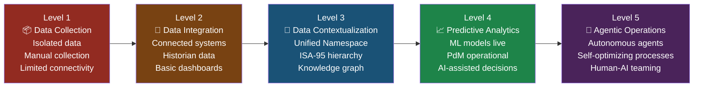
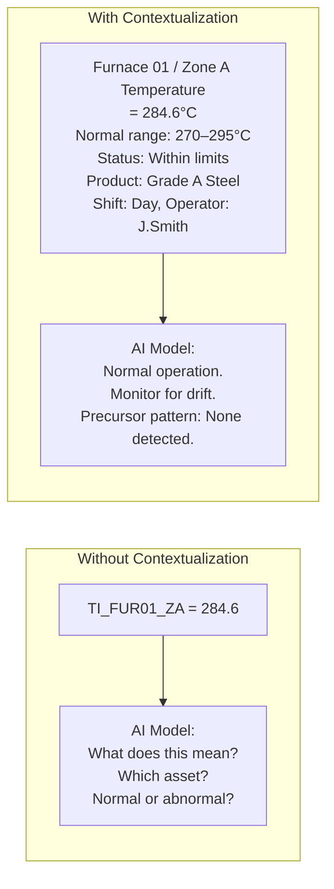
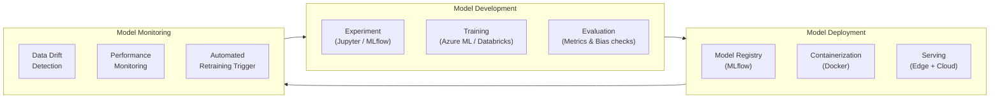
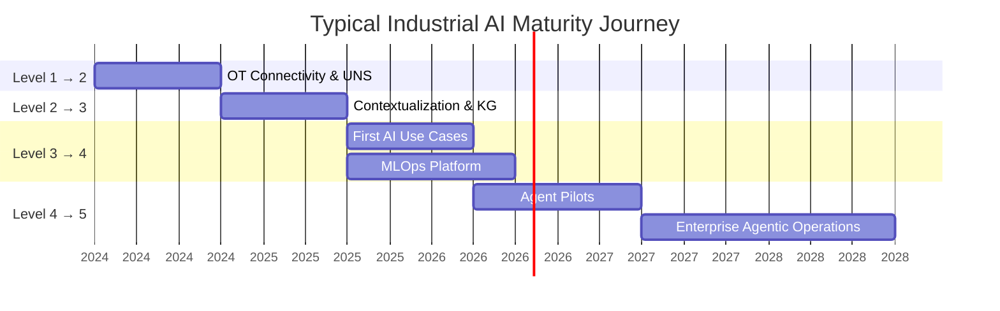

# Industrial AI Maturity Model

> *Based on architectural principles by **Suresh Dakha** ([@dakhasuresh](https://github.com/dakhasuresh)), HCLTech — ISA/IEC 62443 Expert, ISA Senior Member.*

## Overview

The Industrial AI Maturity Model (IAMM) provides a structured framework for assessing where an industrial enterprise sits on its AI journey and what capabilities must be built at each stage to reach the next level.

Most Industrial AI programs fail not because of a shortage of ambition, but because organizations attempt to deploy sophisticated AI capabilities before the foundational data infrastructure is in place. The IAMM makes this dependency explicit.

---

## The Five Levels

---

## Level 1: Data Collection

### Description

At Level 1, the organization collects operational data, but it is fragmented, siloed, and inconsistently structured. Data lives in individual systems — historians, PLCs, SCADA — without integration or contextual enrichment.

### Characteristics

| Dimension | Level 1 State |
|-----------|-------------|
| Data Sources | Isolated; each system is its own island |
| Data Access | Manual extraction, CSV exports, ad hoc queries |
| Data Quality | Unknown or poor; no systematic quality management |
| Integration | Point-to-point or none |
| Analytics | Retrospective reporting; Excel-based analysis |
| AI | No operational AI; possibly isolated pilots |
| OT Security | Minimal segmentation; flat OT networks common |

### Symptoms

- Operators maintain their own spreadsheets to track KPIs
- Data requests to IT take days or weeks
- Different systems report different values for the same metric
- No single source of truth for equipment data
- AI pilots fail to scale due to data unavailability

### Level 1 → Level 2 Prerequisites

- [ ] Complete source system inventory (OT and IT)
- [ ] Network connectivity assessment (OT LAN, DMZ)
- [ ] Executive sponsorship for data integration program
- [ ] Data governance policy established
- [ ] IT/OT collaboration model defined

---

## Level 2: Data Integration

### Description

At Level 2, the organization has connected operational systems using standard protocols and integration patterns. Data flows reliably from the plant floor to enterprise systems, but lacks context and semantic meaning.

### Characteristics

| Dimension | Level 2 State |
|-----------|-------------|
| Data Sources | Connected via OPC-UA, MQTT, or database connectors |
| Data Access | Near-real-time via historian or data platform |
| Data Quality | Monitored; basic quality metrics in place |
| Integration | Unified Namespace deployed or point-to-point with data platform |
| Analytics | Real-time dashboards; basic KPI monitoring |
| AI | Isolated pilots; rule-based alerting |
| OT Security | IEC 62443 zones implemented; DMZ in place |

### Key Capabilities to Build

1. **Edge integration layer** — OPC-UA servers, MQTT publishers, protocol adapters
2. **Unified Namespace** — central MQTT broker with ISA-95 topic taxonomy
3. **Time-series database** — ADX, InfluxDB, or equivalent for historian replacement/augmentation
4. **Basic data platform** — landing zone with raw data ingestion
5. **OT/IT DMZ** — Industrial firewall with controlled data flows

### Level 2 Success Metrics

| Metric | Target |
|--------|--------|
| % of OT systems connected to UNS | > 80% |
| Data latency (OT to enterprise) | < 30 seconds |
| Historian tag availability | > 99% |
| UNS uptime | > 99.5% |

### Level 2 → Level 3 Prerequisites

- [ ] >80% of priority OT systems connected to UNS
- [ ] ISA-95 equipment hierarchy defined for all sites
- [ ] Asset master data quality >80% complete in CMMS
- [ ] Data catalog initiated
- [ ] Historical data archive >2 years for key parameters

---

## Level 3: Data Contextualization

### Description

At Level 3, raw operational data is transformed into information. Every data point is mapped to an ISA-95 asset hierarchy, linked to operational context (product, shift, work order), and connected to a knowledge graph that captures the relationships between assets, parameters, failures, and processes.

This is the pivotal level. Organizations that achieve Level 3 are fundamentally AI-ready. Those that skip it and attempt Level 4 consistently fail or plateau.

### Characteristics

| Dimension | Level 3 State |
|-----------|-------------|
| Data Sources | Fully integrated; UNS covers >90% of priority sources |
| Data Access | Contextualized, labeled, and governed |
| Data Quality | SLA-based quality monitoring; automated data quality enforcement |
| Integration | UNS + ISA-95 alignment; knowledge graph operational |
| Analytics | Context-aware analytics; cross-asset correlation |
| AI | Feature engineering pipeline live; first production ML models |
| OT Security | Zero Trust concepts applied; continuous OT monitoring |

### Key Capabilities to Build

1. **ISA-95 contextualization pipeline** — automated tag-to-hierarchy mapping and enrichment
2. **Industrial knowledge graph** — asset relationships, failure modes, historical events
3. **Data lakehouse (Silver/Gold layers)** — curated, contextualized datasets
4. **Feature store** — reusable ML features for AI training
5. **Data catalog with lineage** — full data provenance from source to AI model

### The Contextualization Imperative

### Level 3 Success Metrics

| Metric | Target |
|--------|--------|
| % of AI-relevant tags with ISA-95 mapping | > 95% |
| Knowledge graph coverage (assets with failure modes) | > 90% of critical assets |
| Feature store coverage (features for top AI use cases) | > 80% |
| Data quality score (completeness, accuracy, timeliness) | > 95% |

### Level 3 → Level 4 Prerequisites

- [ ] Feature store operational with >3 months of data
- [ ] AI governance framework in place
- [ ] Model development and deployment pipeline established (MLOps)
- [ ] Business sponsorship and KPIs defined for each AI use case
- [ ] Human-AI workflow design completed for first use cases

---

## Level 4: Predictive Analytics

### Description

At Level 4, the organization has operational AI and ML models delivering measurable business value. Models are trained, validated, deployed, monitored, and retrained systematically. AI outputs are integrated into operational workflows.

### Characteristics

| Dimension | Level 4 State |
|-----------|-------------|
| Data Sources | Real-time, contextualized, AI-ready |
| Data Access | Feature-served in real-time for model inference |
| Data Quality | Automated quality gates in ML pipelines |
| Integration | AI model outputs published back to UNS |
| Analytics | Predictive; AI-generated insights in operational tools |
| AI | Multiple production models; MLOps platform operational |
| OT Security | AI model integrity monitoring; adversarial input detection |

### Core AI Capabilities at Level 4

| Capability | Description | Typical Model Types |
|------------|-------------|-------------------|
| Predictive Maintenance | Predict equipment failures before they occur | LSTM, Survival Analysis, Random Forest |
| Quality Prediction | Predict product quality from process conditions | Gradient Boosting, Neural Networks |
| Energy Optimization | Optimize energy consumption | Regression, Reinforcement Learning |
| Anomaly Detection | Detect process and equipment anomalies | Autoencoders, Isolation Forest, CUSUM |
| Production Forecasting | Forecast throughput and yield | Time-series forecasting (Prophet, DeepAR) |
| Root Cause Analysis | Identify probable causes of defects/failures | Causal AI, Graph Neural Networks |

### MLOps Architecture

### Level 4 Success Metrics

| Metric | Target |
|--------|--------|
| Production ML models in operation | > 3 use cases |
| PdM model precision (true positive rate) | > 85% |
| Time between model alert and failure | > 14 days average |
| Model prediction accuracy vs baseline | > 20% improvement |
| AI-driven maintenance cost reduction | > 15% |

### Level 4 → Level 5 Prerequisites

- [ ] Multiple stable, high-performance production AI models
- [ ] AI trust established with operations teams
- [ ] Human-in-the-loop workflows proven and accepted
- [ ] Agent framework technology evaluated
- [ ] OT security controls for autonomous action defined and approved

---

## Level 5: Agentic Operations

### Description

At Level 5, the organization deploys autonomous AI agents that can perceive operational conditions, reason over context, plan actions, and execute them — within clearly defined boundaries, with human oversight, and with full audit trails.

This is not "AI taking over." It is structured autonomy: agents handle routine, time-sensitive, or complex multi-step decisions where AI has demonstrated superior speed and accuracy, while humans focus on exceptions, strategy, and oversight.

### Characteristics

| Dimension | Level 5 State |
|-----------|-------------|
| Data Sources | Real-time, self-healing data pipelines |
| Data Access | Agents query knowledge graph, time-series, and documents in real time |
| Data Quality | Autonomous data quality remediation |
| Integration | Bi-directional agent actions (read and write to systems) |
| Analytics | Self-optimizing; continuous closed-loop improvement |
| AI | Multi-agent systems with orchestration and human-in-the-loop |
| OT Security | Agent sandboxing; action authorization; behavior monitoring |

### Agent Capability Examples

| Agent | Trigger | Autonomous Actions | Human Approval Required |
|-------|---------|-------------------|------------------------|
| Maintenance Agent | PdM alert > 80% failure probability | Create work order, reserve parts | Physical intervention, emergency shutdown |
| Quality Agent | Process drift detected | Adjust recipe parameters (in range) | Grade reclassification, material hold |
| Energy Agent | Peak demand event | Shift non-critical loads | Capital investment decisions |
| Production Agent | Unplanned downtime event | Reschedule production sequence | Customer commitment changes |
| OT Security Agent | Anomalous OT network traffic | Isolate affected segment (low risk) | Network changes, system restarts |

### Agentic Maturity Sub-Levels

| Sub-Level | Capability | Description |
|-----------|-----------|-------------|
| 5a | Assisted | Agent provides recommendations; human acts |
| 5b | Supervised Automation | Agent acts; human reviews within defined window |
| 5c | Bounded Autonomy | Agent acts within pre-approved parameter ranges |
| 5d | Full Autonomy | Agent acts and notifies; human reviews retrospectively |

> **Note:** Most industrial organizations should target Level 5b or 5c. Level 5d is appropriate only for well-bounded, low-risk, time-critical actions (e.g., energy load shedding during a demand response event).

---

## Maturity Assessment Scorecard

Use this scorecard to assess current maturity and identify gaps.

| Dimension | L1 | L2 | L3 | L4 | L5 |
|-----------|----|----|----|----|-----|
| Data Connectivity | Isolated | >50% connected | >90% connected | 100% + real-time | Self-healing |
| Data Quality | Unknown | Monitored | SLA-managed | Automated gates | Self-remediated |
| Contextualization | None | Partial mapping | ISA-95 + KG | Feature store live | Agent-queried |
| AI Models | None | Rule-based | 1–2 pilots | 3+ production | Agent-driven |
| MLOps | None | Manual | Version-controlled | Automated pipeline | Continuous learning |
| Human-AI Workflow | None | Alerts only | AI-assisted | AI-recommended | Bounded autonomy |
| OT Security | Basic | DMZ deployed | Zero Trust | AI security monitoring | Agent sandboxing |
| Business Value | None | Visibility | Cost reduction | Quantified ROI | Transformative |

---

## Typical Maturity Journey Timeline

*Total journey: typically 3–5 years for a large industrial enterprise.*
*Fast followers with strong data foundations can compress to 18–24 months for Level 1 → 4.*

---

## Related Documents

- [Industrial AI Reference Architecture](industrial-ai-reference-architecture.md)
- [Agent Fabric Architecture](agent-fabric-architecture.md)
- [Industrial AI Readiness Assessment Template](../templates/industrial-ai-readiness-template.md)
- [Industrial AI Roadmap Template](../templates/industrial-ai-roadmap-template.md)
