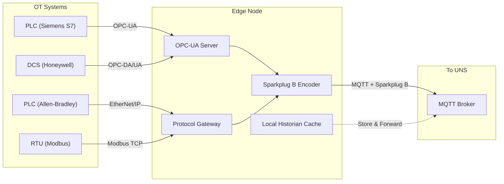
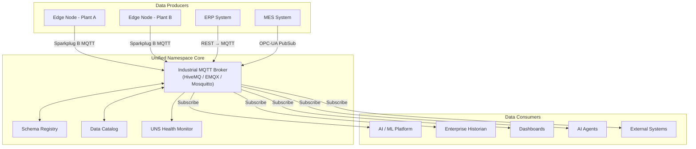
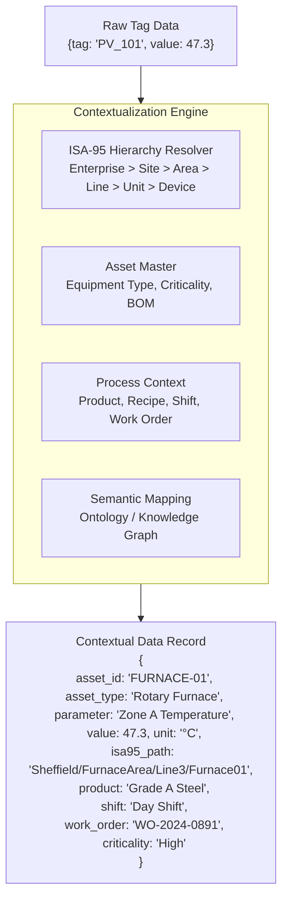
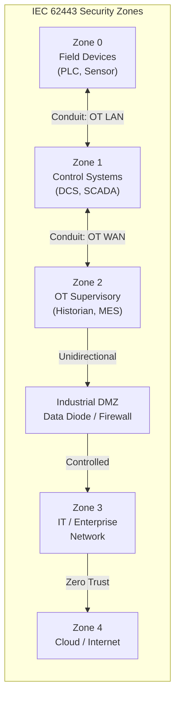

# Industrial AI Reference Architecture

> *Based on architectural principles by **Suresh Dakha** ([@dakhasuresh](https://github.com/dakhasuresh)), HCLTech — ISA/IEC 62443 Expert, ISA Senior Member.*

## Document Purpose

This document defines the master reference architecture for Industrial AI deployments across manufacturing, utilities, oil & gas, energy, mining, and critical infrastructure. It provides a layered, standards-based blueprint for building scalable Industrial AI systems anchored by a robust data backbone.

---

## Architecture Philosophy

Enterprise Industrial AI programs that succeed do so because they solved a data problem before an AI problem. The architecture described here is designed to:

- **Unify** fragmented OT and IT data sources into a single, coherent namespace
- **Contextualize** raw operational data using industry standards (ISA-95, OPC-UA, IEC CIM)
- **Secure** the OT/IT boundary using IEC 62443 principles and Zero Trust concepts
- **Enable** AI and analytics with high-quality, contextual, and timely data
- **Scale** from pilot to enterprise without re-architecture

---

## Full Architecture Stack

```mermaid
graph TB
    classDef source fill:#1a1a2e,color:#eee,stroke:#4a4a8a
    classDef edge fill:#16213e,color:#eee,stroke:#4a4a8a
    classDef uns fill:#0f3460,color:#eee,stroke:#4a90e2
    classDef context fill:#533483,color:#eee,stroke:#9b59b6
    classDef platform fill:#1a5276,color:#eee,stroke:#3498db
    classDef ai fill:#1e8449,color:#eee,stroke:#27ae60
    classDef agent fill:#784212,color:#eee,stroke:#e67e22
    classDef biz fill:#922b21,color:#eee,stroke:#e74c3c
    classDef security fill:#212f3c,color:#eee,stroke:#7f8c8d

    subgraph SRC["🏭 Industrial Data Sources"]
        PLC["PLCs / RTUs"]:::source
        SCADA["SCADA / DCS"]:::source
        HIST["Process Historians"]:::source
        MES["MES / ERP"]:::source
        CMMS["CMMS / EAM"]:::source
        IOT["IoT / IIoT Sensors"]:::source
        LAB["Laboratory / LIMS"]:::source
    end

    subgraph EDGE["⚙️ Edge Integration Layer"]
        OPCUA["OPC-UA Server"]:::edge
        MQTT["MQTT / Sparkplug B"]:::edge
        MODBUS["Modbus / Profinet"]:::edge
        ADAPTERS["Protocol Adapters"]:::edge
        EDGECOMP["Edge Compute Node"]:::edge
    end

    subgraph UNS_LAYER["🔗 Unified Namespace (UNS)"]
        BROKER["Industrial Message Broker"]:::uns
        EVENTS["Event Streaming Platform"]:::uns
        CATALOG["Data Catalog"]:::uns
    end

    subgraph CTX["🧠 Data Contextualization Layer"]
        ISA95["ISA-95 Asset Hierarchy"]:::context
        SEMANTIC["Semantic Models / Ontologies"]:::context
        DT["Digital Twin Models"]:::context
        KG["Industrial Knowledge Graph"]:::context
    end

    subgraph PLATFORM["☁️ Enterprise Data Platform"]
        LAKEHOUSE["Data Lakehouse"]:::platform
        TSDB["Time-Series Database"]:::platform
        FABRIC["Microsoft Fabric / Snowflake"]:::platform
        ADX["Azure Data Explorer"]:::platform
    end

    subgraph AI_LAYER["🤖 AI & Analytics Layer"]
        PREDMAINT["Predictive Maintenance"]:::ai
        QUALAI["Quality Analytics"]:::ai
        ENERGYAI["Energy Optimization"]:::ai
        RCA["Root Cause Analysis"]:::ai
        PRODAI["Production Analytics"]:::ai
    end

    subgraph AGENTS["🦾 Agentic AI Layer"]
        MAGENT["Maintenance Agent"]:::agent
        PAGENT["Production Agent"]:::agent
        QAGENT["Quality Agent"]:::agent
        EAGENT["Energy Agent"]:::agent
        SECAGENT["OT Security Agent"]:::agent
        ORCH["Agent Orchestrator"]:::agent
    end

    subgraph BIZ["📊 Business Applications"]
        EXEC["Executive Dashboards"]:::biz
        OPS["Operational Intelligence"]:::biz
        DSS["Decision Support Systems"]:::biz
    end

    subgraph SEC["🔒 Security Layer (Cross-Cutting)"]
        IAM["Identity & Access Management"]:::security
        ZEROTR["Zero Trust Network Access"]:::security
        IEC62443["IEC 62443 Controls"]:::security
        SIEM["OT SIEM / SOC"]:::security
    end

    SRC --> EDGE --> UNS_LAYER --> CTX --> PLATFORM --> AI_LAYER --> AGENTS --> BIZ
    SEC -.->|Governs| EDGE
    SEC -.->|Governs| UNS_LAYER
    SEC -.->|Governs| PLATFORM
    SEC -.->|Governs| AGENTS
```



---

## Layer Definitions

### Layer 1 — Industrial Data Sources

The origin of all operational truth. These systems generate the process data, event streams, quality records, maintenance logs, and production metrics that underpin every AI use case.

| System | Data Type | Typical Frequency | AI Relevance |
|--------|-----------|-------------------|--------------|
| PLC / RTU | Process values, I/O states | 10ms – 1s | Anomaly detection, control optimization |
| SCADA / DCS | Supervisory data, alarms | 1s – 1min | Process analytics, alarm rationalization |
| Process Historian | Time-series archives | 1s – 1min | Predictive models, trend analysis |
| MES | Production orders, OEE | Batch / event | Production AI, scheduling optimization |
| ERP | Work orders, inventory | Transactional | Maintenance planning, procurement AI |
| CMMS / EAM | Asset records, PM plans | Transactional | Predictive maintenance, asset health |
| IoT / IIoT Sensors | Vibration, temperature, flow | 100ms – 10s | Condition monitoring, digital twins |
| LIMS / Lab | Quality test results | Batch | Quality AI, SPC, grade prediction |

---

### Layer 2 — Edge Integration Layer

The Edge Integration Layer is the industrial protocol translation and normalization boundary. It converts proprietary and legacy OT protocols into open, standards-based formats suitable for the Unified Namespace.



**Key responsibilities:**
- Protocol translation (Modbus, EtherNet/IP, Profinet → OPC-UA → MQTT)
- Data normalization and engineering unit conversion
- Store-and-forward resilience for network interruptions
- Edge preprocessing and filtering
- Local alarm and event processing
- OT/IT DMZ enforcement

---

### Layer 3 — Unified Namespace (UNS)

The Unified Namespace is the central architectural pattern that eliminates point-to-point OT/IT integrations. It provides a single, canonical, real-time namespace for all industrial data.



**Topic namespace taxonomy (ISA-95 aligned):**
```
spBv1.0/{enterprise}/{site}/{area}/{line}/{device}/{tag}

Example:
spBv1.0/Acme_Corp/Sheffield_Plant/Furnace_Area/Line_3/Furnace_01/Temperature_Zone_A
```

→ Full UNS guide: [unified-namespace-guide.md](unified-namespace-guide.md)

---

### Layer 4 — Data Contextualization Layer

Raw OT data is not AI-ready. A tag value of `47.3` from a historian is meaningless without context: *what asset, what parameter, what unit, what process state, what product, what shift?* The contextualization layer adds this intelligence.



**Contextualization components:**
1. **ISA-95 Asset Hierarchy** — maps every tag to an enterprise/site/area/line/unit path
2. **Semantic Models / Ontologies** — defines relationships between assets, parameters, and processes
3. **Digital Twin Models** — virtual representations of physical assets
4. **Industrial Knowledge Graph** — connects assets, events, failures, and outcomes in a graph database

→ See [isa95-contextualization-model.md](isa95-contextualization-model.md) and [industrial-knowledge-graph.md](industrial-knowledge-graph.md)

---

### Layer 5 — Enterprise Data Platform

The Enterprise Data Platform stores, manages, and serves contextual industrial data to AI models, analytics tools, and business applications.

| Component | Technology Options | Use Case |
|-----------|-------------------|---------|
| Time-Series Database | Azure Data Explorer, InfluxDB, TimescaleDB | Real-time process data, historian replacement |
| Data Lakehouse | Microsoft Fabric, Databricks, Snowflake | Historical AI training, batch analytics |
| Operational Data Store | PostgreSQL, SQL Server | Transactional records, asset master |
| Graph Database | Neo4j, Azure Cosmos DB (Gremlin) | Knowledge graph, relationship queries |
| Feature Store | Feast, Tecton, Fabric Feature Store | ML feature management and serving |
| Vector Store | Azure AI Search, Pinecone | RAG for industrial LLMs |

---

### Layer 6 — AI & Analytics Layer

| Capability | Techniques | Typical Output |
|------------|-----------|----------------|
| Predictive Maintenance | LSTM, Random Forest, Survival Analysis | Remaining useful life, failure probability |
| Quality Analytics | SPC, Deep Learning, Multivariate Analysis | Defect prediction, grade classification |
| Energy Optimization | Reinforcement Learning, Regression | Setpoint recommendations, demand forecasting |
| Production Analytics | Time-series forecasting, OEE models | Bottleneck prediction, throughput optimization |
| Root Cause Analysis | Causal AI, Graph traversal, LLM | Failure root cause chains, RCA reports |
| Anomaly Detection | Autoencoders, Isolation Forest | Early warning, process deviation alerts |

---

### Layer 7 — Agentic AI Layer

The Agentic AI Layer represents the frontier of Industrial AI — autonomous, goal-oriented AI agents that can perceive, reason, plan, and act within defined operational boundaries.

| Agent | Primary Role | Data Inputs | Actions |
|-------|-------------|-------------|---------|
| Maintenance Agent | Autonomous maintenance planning | CMMS, sensor data, failure history | Work order creation, parts ordering |
| Production Agent | Production schedule optimization | MES, quality data, demand signals | Schedule adjustments, bottleneck alerts |
| Quality Agent | Real-time quality monitoring | Sensor data, LIMS, SPC | Recipe adjustments, hold recommendations |
| Energy Agent | Energy demand optimization | Meter data, weather, production schedule | Setpoint recommendations, load shifting |
| OT Security Agent | Threat detection and response | Network traffic, OT logs, asset inventory | Alert escalation, isolation recommendations |
| Agent Orchestrator | Multi-agent coordination | All agent inputs/outputs | Task routing, conflict resolution, audit trail |

→ Full agent architecture: [agent-fabric-architecture.md](agent-fabric-architecture.md)

---

## Cross-Cutting: Security Architecture

Security is not a layer — it is a continuous governance function that spans every component of the architecture.



→ Full security reference: [iec62443-security-reference.md](iec62443-security-reference.md)

---

## Architecture Decision Records

### ADR-001: Unified Namespace over Point-to-Point Integration

**Decision:** Adopt UNS as the primary integration pattern for OT/IT data exchange.

**Rationale:** Point-to-point OT/IT integrations create a combinatorial complexity problem. With *n* source systems and *m* consumer systems, you need up to *n × m* integrations. UNS reduces this to *n + m* connections through a central message broker.

**Consequences:** Requires a reliable, high-availability MQTT broker. Topic taxonomy governance is critical.

---

### ADR-002: ISA-95 as the Canonical Context Model

**Decision:** Use ISA-95 as the canonical hierarchy for all asset and data contextualization.

**Rationale:** ISA-95 is the widely adopted international standard for manufacturing operations management integration. It provides a common language across enterprise systems (ERP, MES, CMMS) and plant floor systems.

**Consequences:** Requires upfront investment in asset hierarchy definition and tag mapping.

---

### ADR-003: Edge-First Processing with Cloud Analytics

**Decision:** Process time-critical analytics at the edge; perform training, historical analysis, and cross-site AI at the cloud.

**Rationale:** Network latency and bandwidth constraints make pure cloud-based real-time analytics impractical for many industrial use cases. Edge processing enables low-latency response while cloud enables scale.

**Consequences:** Requires edge compute infrastructure and model deployment pipeline to edge nodes.

---

## Integration Patterns

### Pattern 1: Data Acquisition (OT → UNS)

```
PLC/DCS/SCADA → OPC-UA → Edge Gateway → Sparkplug B/MQTT → UNS Broker
```

### Pattern 2: Data Enrichment (UNS → Contextualization)

```
UNS Broker → Stream Processor → ISA-95 Resolver → Knowledge Graph Lookup → Enriched Event Stream
```

### Pattern 3: AI Inference (Real-Time)

```
Enriched Event Stream → Feature Engine → Deployed Model (Edge/Cloud) → Prediction → Action/Alert
```

### Pattern 4: AI Training (Batch)

```
Data Lakehouse → Feature Store → Training Pipeline → Model Registry → Deployment Pipeline → Edge/Cloud Inference
```

### Pattern 5: Agentic Workflow

```
Trigger (Alert/Schedule/Request) → Agent Perception → Reasoning (LLM + Context) → Plan → Approval Gate → Action → Audit Log
```

---

## Reference Architecture Variants

### Variant A: Greenfield Industrial AI Platform

Recommended for new facilities or brownfield plants with a mandate to modernize.

- Full UNS implementation from day one
- Cloud-native data platform (Microsoft Fabric preferred)
- Agentic AI in Phase 3 of deployment

### Variant B: Brownfield Integration

Recommended for existing facilities with significant legacy OT infrastructure.

- Protocol adapters for legacy systems (Modbus, OPC-DA)
- Historian bridge to UNS
- Incremental contextualization

### Variant C: Multi-Site Enterprise

Recommended for organizations with multiple plants, refineries, or facilities.

- Site-level UNS with enterprise aggregation
- Federated data governance
- Cross-site AI models (fleet learning)

---

## Related Documents

- [Industrial Data Backbone Framework](industrial-data-backbone-framework.md)
- [Unified Namespace Guide](unified-namespace-guide.md)
- [ISA-95 Contextualization Model](isa95-contextualization-model.md)
- [Industrial Knowledge Graph](industrial-knowledge-graph.md)
- [AI Maturity Model](industrial-ai-maturity-model.md)
- [Agent Fabric Architecture](agent-fabric-architecture.md)
- [IEC 62443 Security Reference](iec62443-security-reference.md)
- [iEdgeX Reference Architecture](iedgex-reference-architecture.md)
