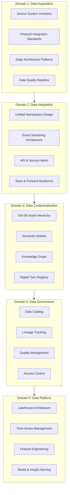
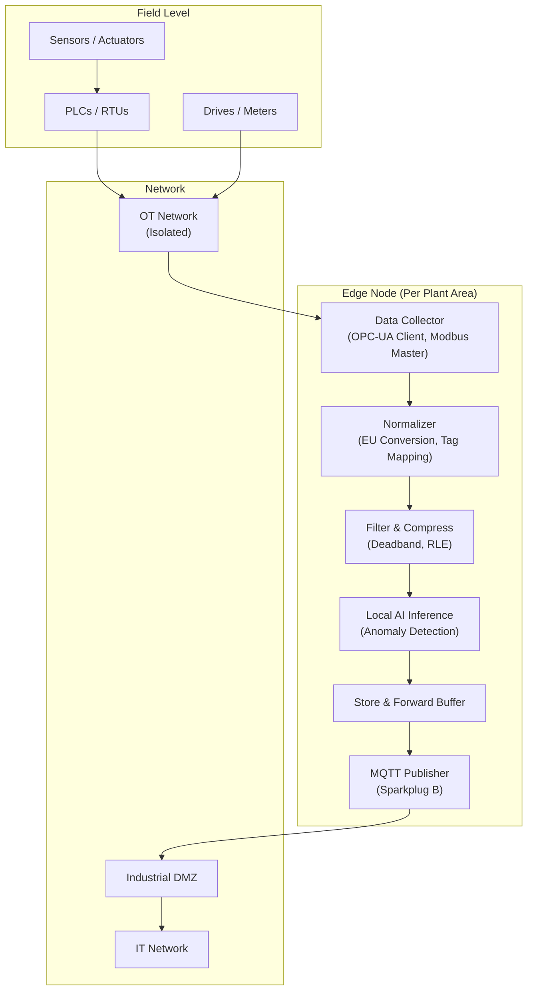
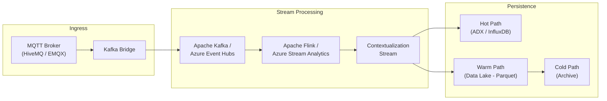
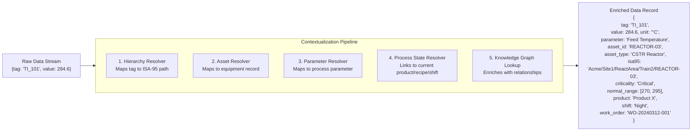
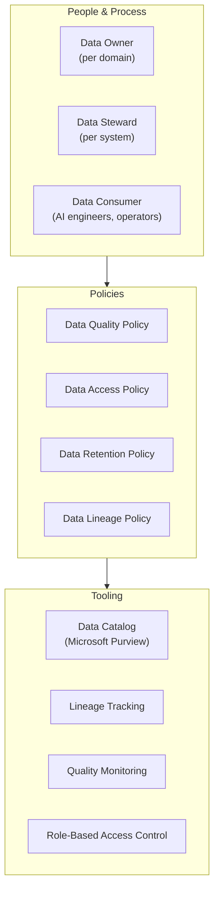
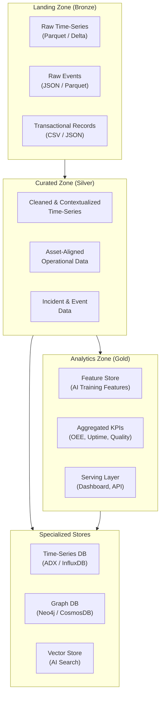
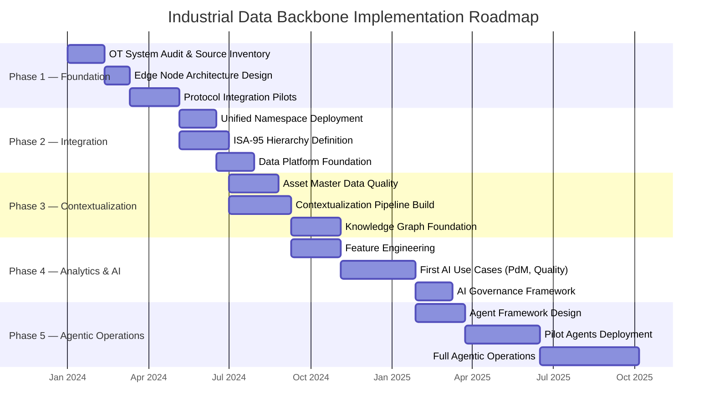

# Industrial Data Backbone Framework

## What Is the Industrial Data Backbone?

The Industrial Data Backbone is the foundational data infrastructure that makes enterprise Industrial AI possible. It is not a single product or platform — it is an architectural pattern: a deliberate, structured approach to connecting, contextualizing, and governing operational data so that AI systems have the high-quality inputs they require.

Without an Industrial Data Backbone, AI initiatives in industrial settings consistently deliver one of three outcomes:

1. **Pilot purgatory** — models that work in controlled conditions but cannot scale to production
2. **Brittle point solutions** — narrow AI applications that cannot be extended or reused
3. **Data quality failures** — models trained on decontextualized, noisy, or incomplete data that produce unreliable outputs

The Industrial Data Backbone eliminates these failure modes by solving the data problem before the AI problem.

---

## Framework Structure

The Industrial Data Backbone Framework consists of five interdependent domains:

---

## Domain 1: Data Acquisition

### Purpose
Establish reliable, standards-based connectivity to every relevant operational data source, from field devices to enterprise systems.

### Key Activities

**Source System Inventory**

Before integrating any data, document what data exists, where it lives, and what protocols are available.

| Activity | Output | Priority |
|----------|--------|----------|
| OT system audit | Source system register | High |
| Protocol capability assessment | Protocol inventory | High |
| Data quality baseline assessment | Quality scorecard | Medium |
| Data volume and frequency profiling | Capacity requirements | Medium |
| Historian tag audit | Tag inventory and rationalization plan | High |

**Protocol Integration Standards**

| Protocol | Typical Source | Integration Pattern | Notes |
|----------|---------------|--------------------|----|
| OPC-UA | PLCs, DCS, SCADA | Native connector → UNS | Preferred modern standard |
| OPC-DA | Legacy PLCs, historians | OPC-DA to OPC-UA bridge | Requires gateway |
| Modbus TCP/RTU | Field devices, meters | Protocol adapter → OPC-UA | Very common in OT |
| EtherNet/IP | Allen-Bradley PLCs | EtherNet/IP adapter | Rockwell ecosystem |
| Profinet | Siemens PLCs | Profinet adapter | Siemens ecosystem |
| MQTT / Sparkplug B | Modern IIoT devices | Native UNS ingestion | Preferred for new deployments |
| REST API | MES, ERP, CMMS | REST → Event bridge | IT systems |
| Database polling | Legacy historians | JDBC/ODBC connector | Last resort |

**Edge Architecture Pattern**

---

## Domain 2: Data Integration

### Purpose
Create a single, canonical, real-time namespace where all operational data is available to any authorized consumer without point-to-point integration.

### Unified Namespace Design Principles

1. **Single source of truth** — each data point has exactly one authoritative publisher in the namespace
2. **Decoupled producers and consumers** — producers do not know who consumes their data and vice versa
3. **ISA-95 aligned topic structure** — topic taxonomy mirrors the enterprise asset hierarchy
4. **Schema governance** — data schemas are registered, versioned, and enforced
5. **Bi-directional** — the UNS supports both data publication (OT→IT) and command/setpoint flows (IT→OT) with appropriate security controls

### Event Streaming Architecture

**Data velocity tiers:**

| Tier | Frequency | Technology | Retention |
|------|-----------|-----------|-----------|
| Hot (real-time) | < 1 second | ADX, InfluxDB, Redis | 7–90 days |
| Warm (operational) | 1s – 1min | Data Lakehouse (Parquet) | 1–3 years |
| Cold (historical) | > 1 min or batched | Object storage (ADLS, S3) | 7–20 years |

---

## Domain 3: Data Contextualization

### Purpose
Transform raw operational data into information — adding the who, what, where, when, and why that AI models and human users need to extract value.

### Contextualization Model

### Contextualization Data Requirements

To contextualize OT data, the following master data must be maintained:

| Data Domain | Source System | Key Fields | Quality Requirement |
|-------------|--------------|------------|---------------------|
| Asset Master | CMMS / EAM | Asset ID, type, area, criticality, parent | Complete, no orphans |
| Tag Metadata | Historian / DCS | Tag name, description, EU, ranges | >95% complete |
| ISA-95 Hierarchy | Manual / ERP | Enterprise > Site > Area > Line > Unit | Fully defined |
| Process Parameters | MES / DCS | Parameter name, type, limits | Linked to assets |
| Product/Recipe | MES / LIMS | Product code, recipe ID, parameters | Linked to process |
| Failure Mode Library | CMMS | Failure code, mode, cause | RCM-based |

---

## Domain 4: Data Governance

### Purpose
Ensure industrial data is trustworthy, discoverable, and managed with appropriate access controls throughout its lifecycle.

### Industrial Data Governance Framework

### Data Quality Dimensions for Industrial AI

| Dimension | Definition | Target | Measurement |
|-----------|-----------|--------|-------------|
| Completeness | % of expected tags reporting values | > 98% | Missing value rate |
| Accuracy | Deviation from calibrated reference | < 0.5% error | Calibration comparison |
| Timeliness | Age of data when consumed | < 5s for real-time | Latency measurement |
| Consistency | Same value across redundant sources | 100% | Cross-source comparison |
| Validity | Values within defined engineering ranges | > 99% | Out-of-range rate |
| Uniqueness | No duplicate records | 100% | Duplicate scan |

---

## Domain 5: Data Platform

### Purpose
Provide a scalable, performant, and cost-effective data storage and serving infrastructure for industrial AI workloads.

### Lakehouse Architecture for Industrial AI

### Platform Technology Selection Guide

| Requirement | Recommended Technology | Rationale |
|-------------|----------------------|-----------|
| Enterprise Microsoft environment | Microsoft Fabric | Native Entra ID, Power BI, unified governance |
| Multi-cloud / vendor neutral | Snowflake + dbt | Strong partner ecosystem, SQL-first |
| High-frequency time-series | Azure Data Explorer | Optimized for industrial telemetry at scale |
| Open source preference | Apache Iceberg + Spark | Fully open, portable, no vendor lock-in |
| Real-time analytics | ksqlDB / Flink SQL | Stream-first analytics |

---

## Implementation Sequence

The Industrial Data Backbone is built in a deliberate sequence. Skipping steps leads to the fragmentation and complexity that the framework is designed to avoid.

---

## Common Implementation Pitfalls

| Pitfall | Symptom | Prevention |
|---------|---------|-----------|
| Starting with AI before data | Model accuracy issues, pilot failures | Enforce data readiness gates before AI projects |
| Tag mapping without context | AI models with no business meaning | Build ISA-95 hierarchy before any integration |
| Skipping the UNS | Proliferating point-to-point integrations | Make UNS adoption a platform standard |
| Ignoring data quality | Garbage in, garbage out for AI models | Instrument quality metrics from day one |
| Vendor lock-in in the data layer | Cannot change platforms later | Use open formats (Parquet, Delta, Arrow) |
| No OT security design | Cyber incident during or after deployment | IEC 62443 review at every architecture phase |
| Big bang implementation | Costs overrun, value delayed | Phase-gate implementation with quick wins |

---

## Related Documents

- [Industrial AI Reference Architecture](industrial-ai-reference-architecture.md)
- [Unified Namespace Guide](unified-namespace-guide.md)
- [ISA-95 Contextualization Model](isa95-contextualization-model.md)
- [Industrial AI Maturity Model](industrial-ai-maturity-model.md)

---

## Attribution

The four architectural principles documented in this framework — protocol interoperability, Unified Namespace as data contract, IEC 62443 cyber-governance from day one, and layered data processing (Bronze/Silver/Gold) — are drawn from practitioner experience and published work by **Suresh Dakha** ([@dakhasuresh](https://github.com/dakhasuresh), HCLTech, 2026): *Why Enterprise Industrial AI Requires a Data Backbone, Not More Models.* Dakha holds ISA/IEC 62443 Expert certification and is an ISA Senior Member with delivery experience across UK gas distribution and global automotive manufacturing.
