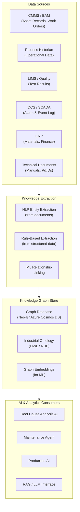
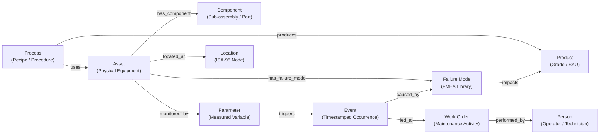
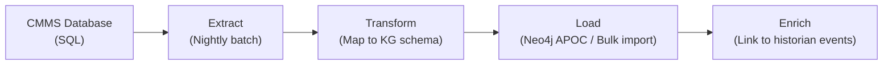
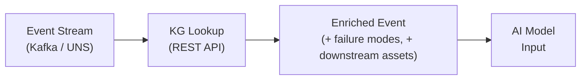
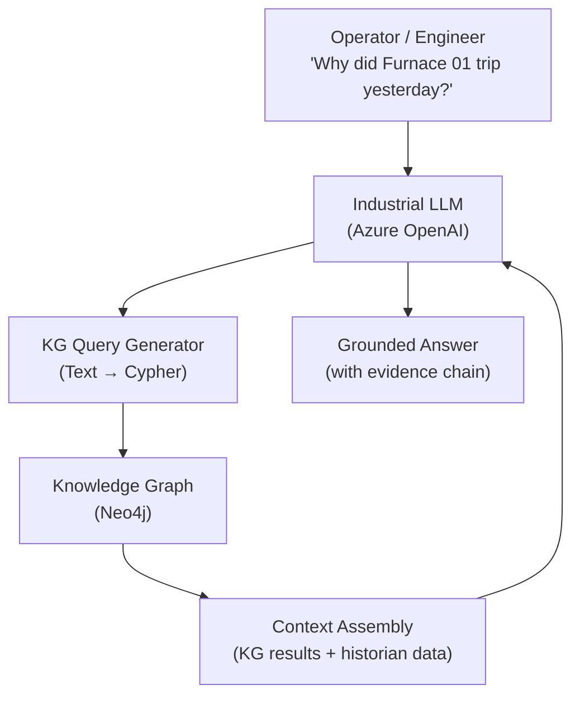

# Industrial Knowledge Graph

> *Based on architectural principles by **Suresh Dakha** ([@dakhasuresh](https://github.com/dakhasuresh)), HCLTech — ISA/IEC 62443 Expert, ISA Senior Member.*

## What Is the Industrial Knowledge Graph?

The Industrial Knowledge Graph (IKG) is the semantic intelligence layer of the Industrial Data Backbone. Where ISA-95 defines hierarchy, the knowledge graph defines **relationships** — the rich, interconnected web of connections between assets, parameters, processes, failures, maintenance actions, and business outcomes that enables advanced AI reasoning.

A knowledge graph goes beyond tabular data models. It represents:

- **Entities** — Assets, components, parameters, products, work orders, failures
- **Relationships** — "contains," "feeds into," "caused by," "affects," "precedes"
- **Attributes** — Properties of entities that change over time
- **Events** — Timestamped state changes and occurrences

When an AI agent asks "What failed on this compressor in the last 3 years, and what upstream conditions preceded those failures?" — the knowledge graph answers.

---

## Knowledge Graph Architecture



---

## Knowledge Graph Ontology

### Core Entity Types



### Relationship Taxonomy

| Relationship | From | To | Description |
|-------------|------|----|-------------|
| `has_component` | Asset | Component | Physical containment |
| `monitored_by` | Asset | Parameter | Sensor/measurement association |
| `located_at` | Asset | Location | ISA-95 spatial context |
| `has_failure_mode` | Asset | Failure Mode | RCM/FMEA library link |
| `caused_by` | Event | Failure Mode | Causal attribution |
| `preceded_by` | Failure | Event | Precursor pattern |
| `led_to` | Event | Work Order | Maintenance trigger |
| `affects_quality_of` | Process State | Product | Quality impact |
| `feeds_into` | Asset | Asset | Process flow dependency |
| `shares_utilities_with` | Asset | Asset | Common failure dependency |
| `maintained_by` | Asset | Person | Responsibility assignment |
| `superseded_by` | Component | Component | Parts replacement history |

---

## Knowledge Graph Data Model

### Asset Node Schema

```json
{
  "node_type": "Asset",
  "id": "ASSET:FURNACE-01",
  "properties": {
    "asset_id": "FURNACE-01",
    "name": "Rotary Hearth Furnace 1",
    "asset_class": "Furnace",
    "sub_class": "RotaryHearth",
    "manufacturer": "SMS Group",
    "model": "RHF-500",
    "serial_number": "SMS-RHF-2018-0042",
    "install_date": "2018-06-15",
    "criticality": "A",
    "maintenance_strategy": "PredictiveMaintenance",
    "isa95_path": "Acme/Sheffield/FurnaceArea/Line3/Furnace01",
    "digital_twin_id": "DT:FURNACE-01"
  }
}
```

### Failure Mode Node Schema

```json
{
  "node_type": "FailureMode",
  "id": "FM:FURNACE-01-REFRACTORY-WEAR",
  "properties": {
    "failure_mode_id": "FM-FURNACE-REFR-001",
    "description": "Refractory Lining Wear",
    "failure_class": "Degradation",
    "detection_method": "Temperature deviation analysis",
    "typical_mtbf_days": 540,
    "typical_repair_hours": 168,
    "safety_criticality": "High",
    "environmental_impact": "Medium",
    "precursor_parameters": [
      "Shell_Temperature_Spot_A",
      "Zone_A_Temperature_Deviation",
      "Fuel_Consumption_Rate"
    ],
    "typical_lead_time_days": 45
  }
}
```

### Event Node Schema

```json
{
  "node_type": "Event",
  "id": "EVENT:20240312-FURNACE01-HIGHTEMP",
  "properties": {
    "event_id": "EVT-20240312-0841",
    "event_type": "ProcessAlarm",
    "event_class": "HighTemperature",
    "asset_id": "FURNACE-01",
    "timestamp": "2024-03-12T14:22:01Z",
    "parameter": "Shell_Temperature_Spot_A",
    "value": 312.4,
    "unit": "°C",
    "alarm_limit": 300.0,
    "severity": "High",
    "operator_response": "Reduced Throughput",
    "duration_minutes": 47
  }
}
```

---

## Knowledge Graph Queries for Industrial AI

### Query 1: Find all failure precursors for an asset class

**Use case:** Feed precursor patterns into predictive maintenance models

```cypher
// Neo4j Cypher query
MATCH (fm:FailureMode)<-[:HAS_FAILURE_MODE]-(asset:Asset {asset_class: 'Furnace'})
MATCH (event:Event)-[:CAUSED_BY]->(fm)
MATCH (precursor:Event)-[:PRECEDED]->(event)
WHERE precursor.timestamp < event.timestamp 
  AND duration.between(precursor.timestamp, event.timestamp).days < 30
RETURN fm.description, 
       collect(DISTINCT precursor.parameter) AS precursor_parameters,
       count(event) AS occurrence_count
ORDER BY occurrence_count DESC
```

### Query 2: Trace failure impact to downstream assets

**Use case:** Production impact analysis and risk prioritization

```cypher
// Find all assets downstream of a failing asset
MATCH path = (failing:Asset {asset_id: 'FURNACE-01'})-[:FEEDS_INTO*1..5]->(downstream:Asset)
RETURN downstream.asset_id, 
       downstream.criticality,
       length(path) AS hops_from_failure
ORDER BY hops_from_failure, downstream.criticality
```

### Query 3: Find similar historical failure events

**Use case:** Root cause analysis and repair recommendation

```cypher
// Find similar events within last 5 years
MATCH (current_event:Event {event_id: 'EVT-20240312-0841'})
MATCH (historical:Event)
  -[:CAUSED_BY]->(fm:FailureMode)
  <-[:HAS_FAILURE_MODE]-(a:Asset {asset_class: 'Furnace'})
WHERE historical.timestamp > datetime('2019-01-01')
  AND historical.parameter = current_event.parameter
  AND abs(historical.value - current_event.value) < 15
MATCH (historical)-[:LED_TO]->(wo:WorkOrder)
RETURN historical.event_id,
       fm.description,
       wo.repair_action,
       wo.actual_labor_hours,
       wo.parts_used
ORDER BY historical.timestamp DESC
LIMIT 10
```

---

## Knowledge Graph Integration Patterns

### Pattern 1: CMMS Ingestion Pipeline



### Pattern 2: Real-Time Event Enrichment



### Pattern 3: LLM + Knowledge Graph (RAG)



---

## Operational Knowledge Graph Use Cases

### Predictive Maintenance Intelligence

The knowledge graph connects sensor anomalies to failure modes, failure modes to historical repair records, and repair records to parts and labor — creating an end-to-end intelligence chain for maintenance decision support.

**Query flow:** Anomaly detected → KG lookup → Failure mode candidates → Historical events → Recommended actions → Parts and resources

### Root Cause Analysis

When a quality defect or production incident occurs, the knowledge graph enables systematic causal tracing through the process chain — from the outcome backward to the root cause.

**Query flow:** Defect event → Upstream process state → Contributing parameters → Asset condition → Failure mode

### Workforce and Knowledge Capture

Maintenance technicians carry years of tacit knowledge about equipment behavior. The knowledge graph captures this knowledge structurally through work order enrichment, creating an institutional memory that persists beyond individual employees.

---

## Knowledge Graph Technology Options

| Technology | Type | Best For | Cloud Option |
|------------|------|---------|-------------|
| **Neo4j** | Native graph DB | Complex graph queries, OLTP | Neo4j Aura |
| **Azure Cosmos DB (Gremlin)** | Multi-model | Azure-native, global scale | Azure managed |
| **Amazon Neptune** | Managed graph | AWS-native | AWS managed |
| **TigerGraph** | Distributed graph | Very large graphs, ML | TigerGraph Cloud |
| **Stardog** | Knowledge graph platform | Ontology + SPARQL | Stardog Cloud |
| **Apache Jena** | Open source RDF | Standards-based, SPARQL | Self-hosted |

**Recommendation:** Neo4j for industrial deployments due to mature tooling, strong Cypher query language, and native graph algorithms library (GDS) useful for influence analysis and community detection.

---

## Implementation Roadmap

### Phase 1: Foundation (Months 1–3)

- Define industrial ontology (asset types, failure mode taxonomy, relationship types)
- Deploy graph database (Neo4j or equivalent)
- Ingest asset master data from CMMS
- Build ISA-95 hierarchy as graph structure
- Establish data pipeline from CMMS to graph

### Phase 2: Event Intelligence (Months 4–6)

- Ingest historical alarm and event data (5+ years recommended)
- Link events to assets and failure modes
- Ingest historical work orders and link to events
- Build failure mode precursor library from historical data

### Phase 3: AI Integration (Months 7–9)

- Build KG query API for AI model feature enrichment
- Implement real-time event enrichment pipeline
- Deploy graph-based RCA capability
- Integrate with LLM for natural language KG querying

### Phase 4: Continuous Learning (Months 10+)

- Automated event-to-failure-mode linking (ML)
- Continuous ingestion from CMMS and historian
- Periodic ontology review and extension
- Knowledge graph quality monitoring dashboard

---

## Related Documents

- [ISA-95 Contextualization Model](isa95-contextualization-model.md)
- [Agent Fabric Architecture](agent-fabric-architecture.md)
- [Industrial AI Reference Architecture](industrial-ai-reference-architecture.md)
