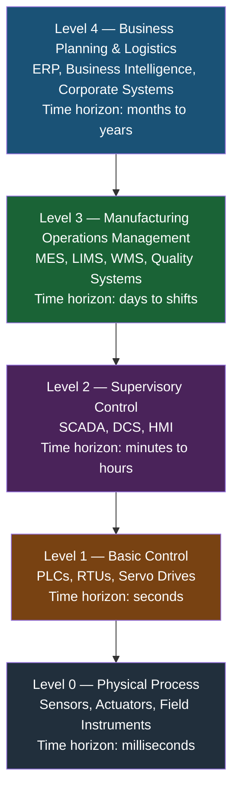
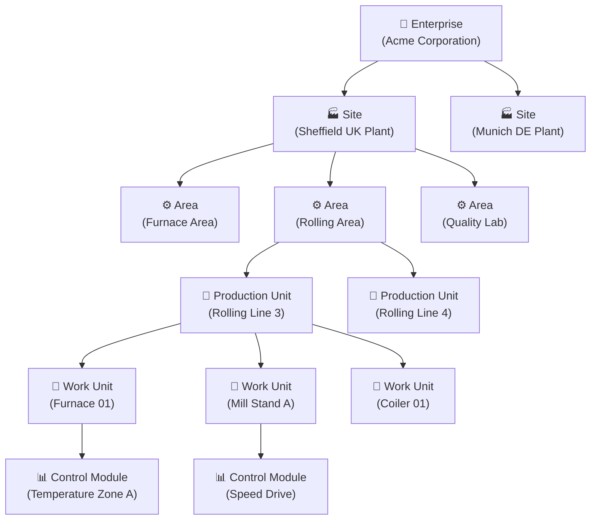
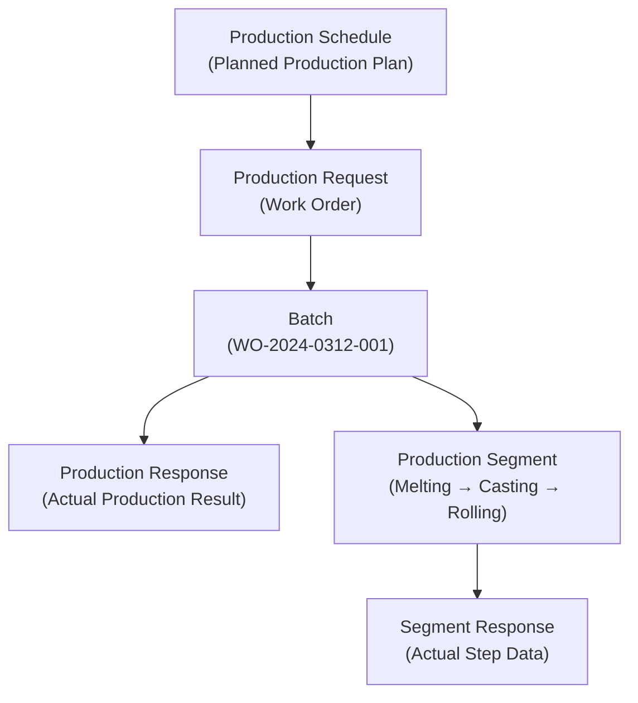
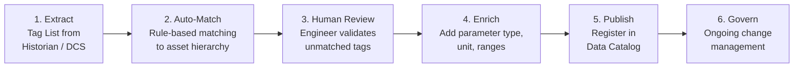
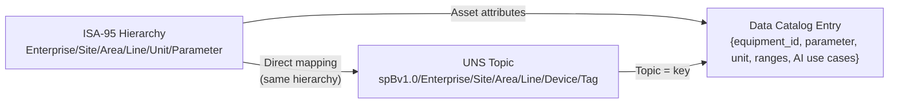

# ISA-95 Contextualization Model

> *Based on architectural principles by **Suresh Dakha** ([@dakhasuresh](https://github.com/dakhasuresh)), HCLTech — ISA/IEC 62443 Expert, ISA Senior Member.*

## Introduction to ISA-95

ISA-95 (also published as IEC 62264) is the international standard for integrating enterprise and control systems. For Industrial AI, ISA-95 provides the canonical framework for contextualizing operational data by establishing a common language and hierarchy that bridges OT and IT systems.

The value of ISA-95 in Industrial AI is not compliance — it is **context**. When every data point is mapped to a standardized hierarchy, AI models gain the spatial, temporal, and process context they need to produce actionable, explainable, and reliable outputs.

---

## ISA-95 Functional Hierarchy



---

## Equipment Hierarchy Model

The ISA-95 equipment hierarchy defines how physical assets are organized for data contextualization purposes. Every sensor reading, alarm, or event must be traceable to a node in this hierarchy.



### Equipment Hierarchy Definitions

| Level | ISA-95 Name | Description | Examples |
|-------|------------|-------------|---------|
| Enterprise | Enterprise | The top-level legal and operational entity | `Acme Corporation` |
| Site | Site | A geographic location | `Sheffield UK`, `Munich DE` |
| Area | Area | A functional or physical zone within a site | `Furnace Area`, `Packaging Area` |
| Production Unit | Production Unit | A group of equipment with a common function | `Rolling Line 3`, `Reactor Train A` |
| Work Unit | Work Unit | An individual piece of equipment | `Furnace 01`, `Pump P-101` |
| Control Module | Control Module | A logical control element | `Temperature Zone A`, `Flow Loop PIC-101` |

---

## Operations Hierarchy Model

Alongside the equipment hierarchy, ISA-95 defines the operations hierarchy — the context of *what is being produced* and *how*.



### Combining Equipment + Operations Context

The power of ISA-95 contextualization comes from combining both hierarchies:

```
{equipment_path} + {operation_context} = Fully Contextualized Data Point

Example:
  Equipment:    Acme/Sheffield/FurnaceArea/Line3/Furnace01/Temperature_Zone_A
  Operations:   WorkOrder: WO-2024-0312, Product: Grade-A-Steel, Phase: Heat-Soak
  Shift:        Day Shift, Operator: J.Smith
  Result:       Temperature_Zone_A = 284.6°C @ 2024-03-12 14:22:01
                → During Grade-A-Steel production, Soak phase, Day Shift
```

---

## ISA-95 Data Models

### Part 2: Object Model Attributes

ISA-95 Part 2 defines the attribute model for equipment objects — the metadata that must be maintained for each node in the hierarchy.

**Equipment Entity Attributes:**

```json
{
  "equipment_id": "FURNACE-01",
  "description": "Rotary Hearth Furnace 1",
  "equipment_class": ["Furnace", "HeatTreatment"],
  "location": {
    "enterprise": "Acme_Corp",
    "site": "Sheffield_UK",
    "area": "Furnace_Area",
    "production_unit": "Rolling_Line_3"
  },
  "properties": {
    "manufacturer": "SMS Group",
    "model": "RHF-500",
    "install_date": "2018-06-15",
    "design_capacity": "500 t/day",
    "fuel_type": "Natural Gas",
    "criticality": "Critical",
    "maintenance_strategy": "PdM"
  },
  "capabilities": [
    { "capability": "MaxTemperature", "value": 1350, "unit": "°C" },
    { "capability": "MaxThroughput", "value": 500, "unit": "t/day" }
  ]
}
```

---

## Tag-to-ISA-95 Mapping Process

One of the most important — and most commonly neglected — activities in building an Industrial Data Backbone is **tag mapping**: the process of linking every historian tag, OPC-UA node, or MQTT topic to a node in the ISA-95 hierarchy.

### Tag Mapping Workflow



### Tag Mapping Data Structure

```json
{
  "source_tag": "TI_FUR01_ZA",
  "source_system": "OSIsoft PI",
  "isa95_path": "Acme_Corp/Sheffield_UK/Furnace_Area/Rolling_Line_3/Furnace_01",
  "control_module": "Temperature_Zone_A",
  "parameter_type": "ProcessVariable",
  "parameter_category": "Temperature",
  "unit_of_measure": "°C",
  "engineering_low": 0.0,
  "engineering_high": 1400.0,
  "normal_low": 270.0,
  "normal_high": 295.0,
  "alarm_low": 250.0,
  "alarm_high": 310.0,
  "sample_rate_seconds": 1,
  "data_type": "Float",
  "is_ai_relevant": true,
  "ai_use_cases": ["PredictiveMaintenance", "EnergyOptimization", "ProcessOptimization"]
}
```

---

## ISA-95 and the Unified Namespace

The ISA-95 hierarchy directly defines the UNS topic taxonomy. This alignment ensures that every message in the UNS carries its full operational context in the topic path itself.



---

## ISA-95 Parts Relevant to Industrial AI

| Part | Title | Relevance to AI |
|------|-------|----------------|
| Part 1 | Models and Terminology | Equipment hierarchy — the backbone of all contextualization |
| Part 2 | Object Model Attributes | Asset attribute model — feeds the Digital Twin |
| Part 3 | Activity Models | Process activity context for production AI |
| Part 4 | Object & Attributes of Manufacturing Operations | MES integration for production and quality AI |
| Part 5 | Business-to-Manufacturing Transactions | ERP/MES transaction patterns for scheduling AI |

---

## ISA-95 Implementation Checklist

### Equipment Hierarchy

- [ ] Enterprise and site structure defined
- [ ] All production areas defined and named consistently
- [ ] All production units mapped to areas
- [ ] All work units (equipment) mapped to production units
- [ ] Equipment attributes populated (manufacturer, model, criticality)
- [ ] Hierarchy stored in CMMS / EAM as system of record

### Tag Mapping

- [ ] Complete tag inventory extracted from all historians and DCS
- [ ] Tag-to-ISA-95 path mapping completed (>95% coverage)
- [ ] Parameter type and category defined for all AI-relevant tags
- [ ] Engineering units validated for all tags
- [ ] Normal and alarm ranges defined
- [ ] Mapping registered in Data Catalog

### Operations Context

- [ ] Product hierarchy defined (product family / grade / SKU)
- [ ] Recipe library linked to equipment capabilities
- [ ] Work order integration from ERP/MES to contextualization pipeline
- [ ] Shift schedule integration to contextualization pipeline

---

## Common ISA-95 Mistakes to Avoid

| Mistake | Impact | Correction |
|---------|--------|-----------|
| Inconsistent naming across sites | AI models cannot learn cross-site patterns | Standardize names in master ISA-95 hierarchy |
| Equipment in wrong area | Misrouted alerts and incorrect context | Annual hierarchy audit against physical plant layout |
| Missing intermediate levels | Broken hierarchy traversal queries | Enforce hierarchy completeness in CMMS |
| Not linking tags to hierarchy | Decontextualized data, AI model failures | Make tag mapping a gate in data onboarding process |
| Hierarchy only in ERP | Disconnected from OT data | Publish hierarchy to Data Catalog and UNS Schema Registry |

---

## Related Documents

- [Unified Namespace Guide](unified-namespace-guide.md)
- [Industrial Knowledge Graph](industrial-knowledge-graph.md)
- [Industrial Data Backbone Framework](industrial-data-backbone-framework.md)
