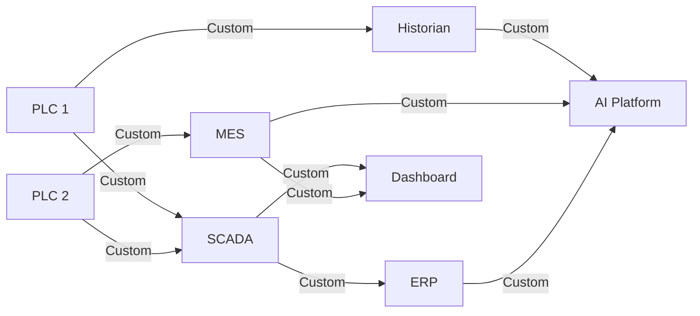
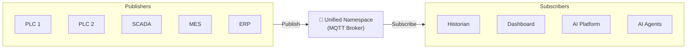
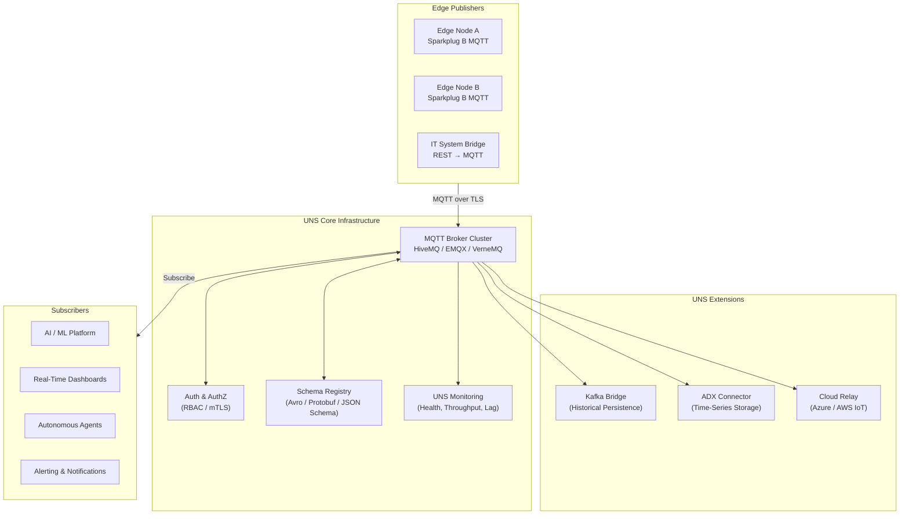
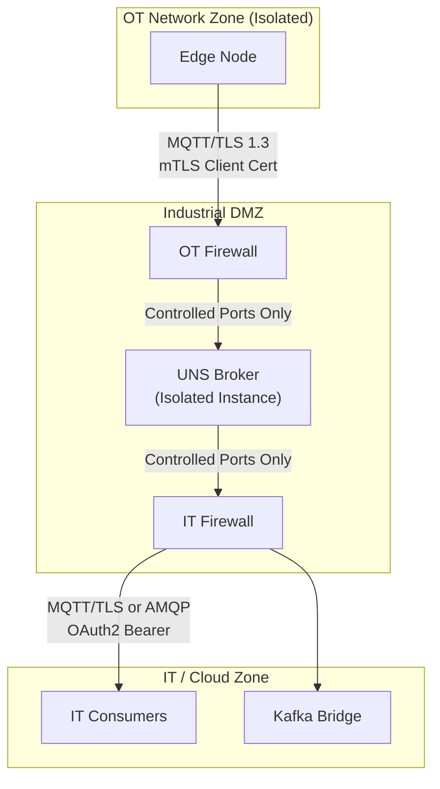
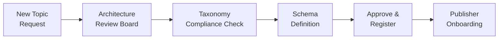

# Unified Namespace (UNS) Design Guide

> *Based on architectural principles by **Suresh Dakha** ([@dakhasuresh](https://github.com/dakhasuresh)), HCLTech — ISA/IEC 62443 Expert, ISA Senior Member.*

## What Is the Unified Namespace?

The Unified Namespace (UNS) is the central architectural pattern for Industrial IoT and Industrial AI integration. Coined and popularized by Walker Reynolds, the UNS concept establishes a single, canonical, real-time namespace for all operational data across an enterprise — eliminating the complexity and fragility of point-to-point OT/IT integrations.

The UNS is **not a product**. It is an architectural pattern, typically implemented using a message broker (MQTT) with a defined topic taxonomy aligned to the enterprise asset hierarchy (ISA-95).

---

## The Problem UNS Solves

### Before UNS: Point-to-Point Integration Hell



*Result: N × M integrations. Fragile, expensive, unmaintainable.*

### After UNS: Publish/Subscribe Simplicity



*Result: N + M connections. Decoupled, scalable, maintainable.*

---

## UNS Architecture Components



---

## Topic Taxonomy Design

The UNS topic structure is the most important governance decision in the UNS design. It must be:

- **Stable** — changing topic structures breaks consumers
- **Hierarchical** — reflects the enterprise asset hierarchy
- **Consistent** — the same pattern applied everywhere
- **ISA-95 aligned** — maps to enterprise model

### Recommended Topic Structure (ISA-95 + Sparkplug B)

```
spBv1.0/{enterprise}/{site}/{area}/{line}/{device}/{tag}
```

| Level | ISA-95 Level | Example |
|-------|-------------|---------|
| `{enterprise}` | Level 4 / Enterprise | `Acme_Corp` |
| `{site}` | Level 3 / Site | `Sheffield_UK` |
| `{area}` | Level 3 / Area | `Furnace_Area` |
| `{line}` | Level 2 / Production Line | `Rolling_Line_3` |
| `{device}` | Level 1 / Equipment | `Furnace_01` |
| `{tag}` | Level 0 / Process Tag | `Temperature_Zone_A` |

### Topic Examples

```
# Furnace temperature sensor
spBv1.0/Acme_Corp/Sheffield_UK/Furnace_Area/Rolling_Line_3/Furnace_01/Temperature_Zone_A

# Pump vibration (X-axis)
spBv1.0/Acme_Corp/Sheffield_UK/Utilities/Cooling_Water/Pump_CW_07/Vibration_X_RMS

# MES Production Order (IT data in UNS)
spBv1.0/Acme_Corp/Sheffield_UK/MES/Production_Orders/Active_Order/Grade

# Quality result
spBv1.0/Acme_Corp/Sheffield_UK/Quality_Lab/Lab_01/Test_Result_HB/Value
```

### Special Topic Namespaces

| Namespace | Purpose | Example |
|-----------|---------|---------|
| `STATE/` | Asset operational state | `STATE/Sheffield_UK/Furnace_01/RunState` |
| `COMMAND/` | IT→OT commands (controlled) | `COMMAND/Sheffield_UK/Furnace_01/Setpoint_Zone_A` |
| `ALERT/` | Alarm and alert events | `ALERT/Sheffield_UK/Furnace_Area/Line3/Furnace_01/HighTemp` |
| `KPI/` | Computed KPI values | `KPI/Sheffield_UK/Rolling_Line_3/OEE` |
| `AI/` | AI model outputs | `AI/Sheffield_UK/Furnace_01/RUL_Prediction` |

---

## Sparkplug B Payload Standard

Sparkplug B is the recommended payload encoding standard for industrial MQTT. It provides:

- **Birth/Death certificates** — devices announce presence and disconnection
- **Data compression** — efficient binary encoding using Google Protobuf
- **Metric naming** — standardized metric structure with name, type, value, and timestamp
- **Primary host** — single writer per topic for data integrity

### Sparkplug B Message Types

| Message Type | Purpose |
|-------------|---------|
| `NBIRTH` | Node birth — device connects and announces metrics |
| `NDATA` | Node data — metric value updates |
| `NDEATH` | Node death — device disconnects |
| `DBIRTH` | Device birth — logical device on a node |
| `DDATA` | Device data — device metric update |
| `DDEATH` | Device death — logical device disconnect |
| `NCMD` | Node command — send command to device |
| `DCMD` | Device command — send command to logical device |

### Example Sparkplug B Payload (JSON representation)

```json
{
  "timestamp": 1711036800000,
  "metrics": [
    {
      "name": "Temperature_Zone_A",
      "timestamp": 1711036800000,
      "dataType": "Float",
      "value": 284.6,
      "properties": {
        "engUnit": { "type": "String", "value": "°C" },
        "engLow": { "type": "Float", "value": 250.0 },
        "engHigh": { "type": "Float", "value": 320.0 }
      }
    }
  ],
  "seq": 1042
}
```

---

## Broker Selection Guide

| Broker | License | Scale | Cloud | Best For |
|--------|---------|-------|-------|---------|
| **HiveMQ** | Commercial (OSS tier) | Enterprise | Azure/AWS/GCP | Large industrial deployments |
| **EMQX** | Apache / Commercial | Very large | Any | High-throughput IoT |
| **Mosquitto** | Eclipse / Open Source | Small-medium | Self-hosted | SME / pilot deployments |
| **AWS IoT Core** | Managed | Unlimited | AWS | AWS-native architectures |
| **Azure IoT Hub** | Managed | Unlimited | Azure | Azure-native architectures |
| **VerneMQ** | Apache / Commercial | Large | Self-hosted | Open source enterprise |

**Recommendation for enterprise industrial deployments:** HiveMQ or EMQX for on-premises UNS core, with cloud relay to Azure IoT Hub or AWS IoT Core for cloud analytics.

---

## UNS Security Architecture

The UNS is a critical OT/IT integration point and must be secured accordingly.



**Security controls:**

| Control | Implementation |
|---------|---------------|
| Transport encryption | TLS 1.3 on all MQTT connections |
| Client authentication | mTLS (mutual TLS) with per-device certificates |
| Authorization | Topic ACLs per client — publish only to own topics |
| OT→IT boundary | Unidirectional by default; bidirectional (`COMMAND/`) requires explicit approval per topic |
| Audit logging | All publish/subscribe activity logged to SIEM |
| Certificate management | PKI with automated certificate rotation |

---

## UNS Governance Model

### Topic Governance Process



### Naming Conventions Policy

- Use **PascalCase** for all topic segments (`FurnaceArea`, not `furnace_area`)
- No spaces, special characters, or leading numbers
- Maximum topic depth: 8 levels
- Maximum topic length: 256 characters
- Use ISA-95 naming for all Level 0–3 segments

### Schema Governance

All data published to the UNS must have a registered schema:

1. Schema defined in JSON Schema or Protobuf format
2. Schema registered in the Schema Registry with version
3. Publishers validate payloads against schema before publishing
4. Breaking schema changes require version increment and migration period

---

## UNS Health Monitoring

A production UNS requires continuous monitoring across these dimensions:

| Metric | Description | Alert Threshold |
|--------|-------------|----------------|
| Message rate | Messages per second per topic | Anomalous drop > 20% |
| Consumer lag | Age of oldest unprocessed message | > 30 seconds |
| Connection count | Active MQTT connections | > 90% of broker limit |
| Broker CPU / Memory | Broker resource utilization | > 80% sustained |
| Dead node detection | Devices not sending NBIRTH after reconnect | Any |
| TLS certificate expiry | Days until certificate expiry | < 30 days |

---

## Implementation Checklist

### Phase 1: UNS Foundation

- [ ] Define enterprise topic taxonomy aligned to ISA-95 hierarchy
- [ ] Select and deploy MQTT broker (HA cluster recommended)
- [ ] Implement PKI and certificate management for all edge nodes
- [ ] Configure topic ACLs and RBAC
- [ ] Deploy schema registry
- [ ] Establish UNS monitoring and alerting

### Phase 2: Edge Onboarding

- [ ] Deploy edge nodes per plant area
- [ ] Implement Sparkplug B encoding on all edge publishers
- [ ] Validate topic taxonomy compliance for each source
- [ ] Test store-and-forward resilience
- [ ] Conduct OT security review of each integration

### Phase 3: Consumer Integration

- [ ] Connect enterprise data platform (Kafka bridge or direct connector)
- [ ] Validate data quality at consumption point
- [ ] Implement schema validation in consumer pipelines
- [ ] Document all consumer subscriptions in Data Catalog

---

## Related Documents

- [ISA-95 Contextualization Model](isa95-contextualization-model.md)
- [Industrial AI Reference Architecture](industrial-ai-reference-architecture.md)
- [IEC 62443 Security Reference](iec62443-security-reference.md)
