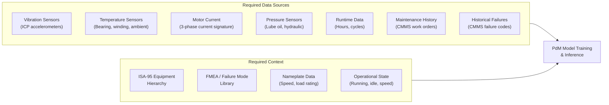
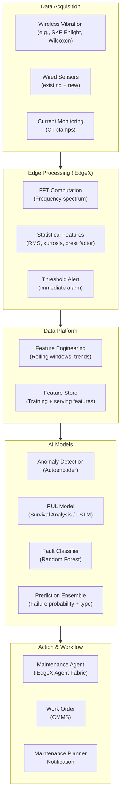
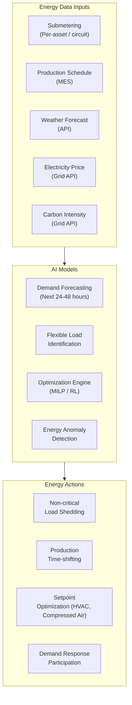

# Manufacturing Use Cases

## Overview

This document details Industrial AI use cases for manufacturing environments built on the Industrial Data Backbone. Each use case describes the business problem, data requirements, architecture pattern, AI approach, and expected outcomes.

---

## Predictive Maintenance

### Business Problem

Unplanned equipment failures in manufacturing cause cascading production losses, quality escapes, safety incidents, and maintenance costs that are 3–5× higher than planned maintenance. Traditional time-based preventive maintenance addresses this partially but generates unnecessary downtime and parts consumption for healthy equipment.

Predictive maintenance (PdM) uses sensor data, historical failure records, and AI models to predict when specific equipment is likely to fail — enabling maintenance to be scheduled optimally in advance.

### Business Value

| Metric | Typical Improvement |
|--------|-------------------|
| Unplanned downtime reduction | 30–50% |
| Maintenance cost reduction | 15–25% |
| Parts inventory reduction | 10–20% |
| Mean time between failures (MTBF) | +20–35% |
| Safety incidents (maintenance-related) | –40% |

### Data Requirements



### Architecture Pattern



### AI Model Architecture

**Multi-model ensemble approach:**

1. **Anomaly Detection Model (Autoencoder)**
   - Detects deviation from learned normal behavior
   - Unsupervised — no labeled failure data required
   - Output: Anomaly score (0–1)

2. **Remaining Useful Life Model (Survival Analysis / LSTM)**
   - Predicts time to failure distribution
   - Requires labeled failure history (>20 historical failures per failure mode)
   - Output: P50 and P90 remaining days

3. **Fault Classification Model (Random Forest / XGBoost)**
   - Classifies likely failure type when anomaly is detected
   - Input: Spectral features (FFT harmonics, sidebands, bearing frequencies)
   - Output: Fault class (bearing, imbalance, misalignment, looseness)

4. **Ensemble Aggregator**
   - Combines outputs into a single failure probability and urgency score
   - Risk matrix: probability × consequence → priority

### Implementation Phases

**Phase 1 (Months 1–3):** Sensor audit and gap analysis; define critical equipment list; retrofit sensors on top-20 highest-risk assets.

**Phase 2 (Months 4–6):** Edge feature extraction deployment; data collection period (minimum 3 months before model training); historical CMMS data ingestion.

**Phase 3 (Months 7–9):** Model training on historical data; shadow mode deployment (model runs; recommendations not acted on); performance validation against historical failures.

**Phase 4 (Months 10–12):** Live deployment; Maintenance Agent activated; CMMS integration for automated work order creation; performance monitoring.

---

## Quality Analytics

### Business Problem

Manufacturing quality defects generate scrap, rework, warranty claims, customer complaints, and regulatory compliance risks. Traditional SPC approaches monitor individual parameters against fixed limits but cannot detect the complex multivariate interactions that produce defects in modern manufacturing processes.

AI-powered quality analytics predicts defects before they occur by monitoring the combined state of dozens of process parameters and identifying the subtle signatures that precede quality failures.

### Business Value

| Metric | Typical Improvement |
|--------|-------------------|
| First-pass yield improvement | +2–8 percentage points |
| Scrap cost reduction | 20–40% |
| Rework cost reduction | 25–35% |
| Customer complaint reduction | 30–50% |
| Quality lab testing cost | –20% (AI pre-screening) |

### Data Requirements

| Data Source | Parameters | Importance |
|-------------|-----------|-----------|
| Process sensors | Temperature, pressure, flow, pH, concentration | Critical |
| Recipe data | Target values, tolerances, step sequence | Critical |
| Material inputs | Raw material grade, lot, chemical analysis | High |
| Equipment state | Running hours, last calibration, maintenance history | High |
| Environmental | Ambient temperature, humidity | Medium |
| Lab results | Chemical, physical, dimensional tests | Critical (label) |

### Architecture Pattern



```mermaid
graph LR
    subgraph RT_MONITOR["Real-Time Quality Monitoring"]
        SPC_MULTI["Multivariate SPC\n(Hotelling T², MSPC)"]
        DRIFT_DET["Process Drift\nDetection"]
        RECIPE_MON["Recipe Deviation\nMonitoring"]
    end

    subgraph PREDICT["Quality Prediction"]
        FEAT_ENG["Feature Engineering\n(Lag features, rolling stats)"]
        GRADE_MODEL["Grade Prediction Model\n(XGBoost / Neural Net)"]
        DEFECT_MODEL["Defect Probability Model\n(Classifier)"]
    end

    subgraph RESPONSE["Response & Action"]
        QUAL_AGENT["Quality Agent\n(Adjustment recommendations)"]
        HOLD_TRIGGER["Product Hold\nTrigger"]
        RECIPE_ADJ["Recipe Micro-adjustment\n(Within pre-approved range)"]
        QC_ALERT["QC Manager Alert"]
    end

    RT_MONITOR --> PREDICT --> RESPONSE
```

### Use Case: Predictive Grade in Steel Rolling

**Problem:** In a hot rolling mill, the final mechanical properties of the steel coil (tensile strength, yield strength, hardness) are determined by a complex interaction of temperature profile, reduction schedule, and cooling rate. Traditional approaches test the final product, generating 4–6 hours of uncertain quality status (WIP in an unknown state).

**AI Solution:**
- Monitor 120+ process parameters across the furnace, rolling stands, and cooling sections in real time
- Train a model on 36 months of process data and corresponding lab results (mechanical testing)
- Predict final mechanical properties with 95% accuracy 40 minutes before the coil is cooled and cut
- Enable early process adjustments to bring out-of-spec predictions back into range

**Data flow:**

```
UNS (real-time process → contextualized features → grade model → prediction published to UNS)
→ Quality Agent receives prediction
→ If deviation predicted: notify metallurgist + recommend adjustment
→ If out-of-spec: trigger automated product hold for lab verification
```

---

## Energy Optimization

### Business Problem

Energy is the second or third largest cost in most manufacturing operations, yet most plants manage energy reactively — monitoring consumption rather than actively optimizing it. Energy costs are also increasingly variable (real-time electricity pricing, peak demand charges) and carry carbon implications that affect regulatory compliance and sustainability commitments.

AI-powered energy optimization continuously matches energy-intensive operations to the lowest-cost, lowest-carbon energy windows while respecting production constraints.

### Business Value

| Metric | Typical Improvement |
|--------|-------------------|
| Energy cost reduction | 8–18% |
| Peak demand charge reduction | 15–30% |
| Carbon intensity reduction | 10–20% |
| Energy waste identification | 5–10% of baseline consumption |
| Demand response revenue | New revenue stream |

### Data Requirements

| Data Source | Data Type | Frequency |
|-------------|-----------|-----------|
| Smart energy meters | kWh, kVA, kVAr (per circuit / asset) | 15-second intervals |
| Production schedule | Planned orders, machine assignments | Daily |
| Weather forecast | Temperature, humidity (affects HVAC load) | Hourly forecast |
| Electricity price signal | Real-time / day-ahead pricing | 30-minute intervals |
| Grid carbon intensity | gCO₂/kWh | Hourly |
| Asset energy profiles | Per-asset consumption models | Historical |

### Architecture Pattern



### Use Case: Compressed Air Optimization

**Problem:** Compressed air systems typically waste 20–30% of their energy due to leaks, over-pressure, inefficient control, and unnecessary consumption by idle equipment.

**AI Solution:**
1. Deploy pressure, flow, and consumption sensors across the compressed air network
2. Build a digital model of the compressed air system (pipe network, compressor characteristics)
3. Train an anomaly detection model on normal consumption patterns
4. Identify waste: leaks (abnormal consumption when no production), over-pressure events, and equipment consuming air when idle
5. Optimize compressor staging (right number of compressors at the right time)
6. Monitor continuously and alert when waste patterns re-emerge

**Expected outcomes:** 15–22% reduction in compressed air system energy consumption; identification of leaks worth £150–400K per year in a large facility.

---

## Related Documents

- [Utility Use Cases](utility-use-cases.md)
- [Oil & Gas Use Cases](oil-gas-use-cases.md)
- [Industrial AI Maturity Model](../docs/industrial-ai-maturity-model.md)
- [Agent Fabric Architecture](../docs/agent-fabric-architecture.md)
