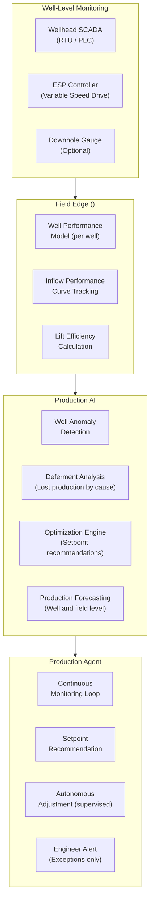
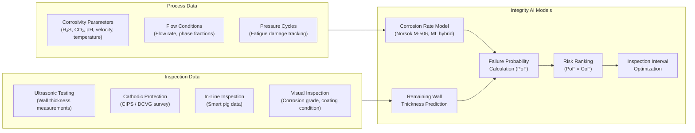
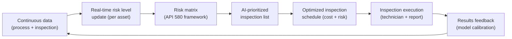
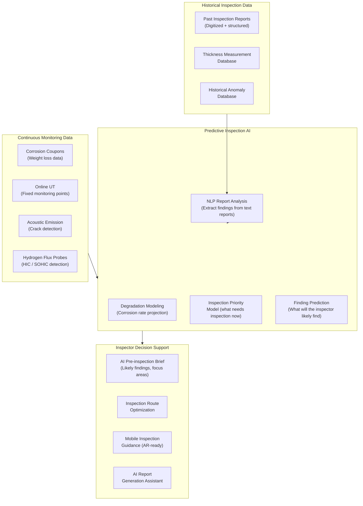
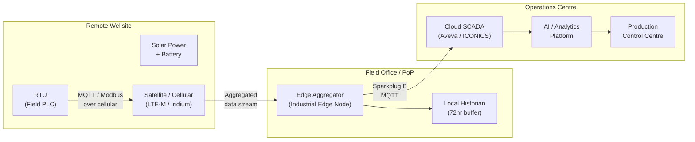

# Oil & Gas Use Cases

## Overview

The oil and gas sector operates some of the most complex, high-value, and high-consequence industrial assets in the world. From upstream production to downstream refining, AI has transformational potential — but only when built on a foundation of reliable, contextual, and secure operational data. The Industrial Data Backbone is that foundation.

---

## Production Optimization

### Business Problem

Hydrocarbon production is an intrinsically complex optimization problem. Each well has a unique production profile that degrades over time. Lift systems (ESP, rod pump, gas lift) must be tuned to maximize production while managing energy consumption, artificial lift costs, and equipment wear. Traditional approaches rely on periodic engineer reviews — too slow and too infrequent to capture the real-time opportunity.

AI-driven production optimization continuously monitors well and reservoir conditions, identifies underperformance, and recommends or autonomously implements operational changes to maximize production.

### Business Value

| Metric | Typical Improvement |
|--------|-------------------|
| Production uplift | 3–8% additional production |
| Energy cost reduction (ESPs) | 10–20% |
| Artificial lift optimization | 15–25% reduction in lift cost per barrel |
| Well intervention cost reduction | 20–30% (better timing, better targeting) |
| Engineer productivity | 3–5× (AI handles routine monitoring) |

### Data Requirements

| Source | Parameters | Frequency |
|--------|-----------|-----------|
| Wellhead sensors | Tubing/casing pressure, temperature, flow rate | 1–60 second intervals |
| ESP controllers | Motor current, frequency, torque, vibration | 1–60 second intervals |
| SCADA | Separator conditions, pipeline pressure, valve states | 1-minute intervals |
| Metering | Oil, water, gas rates per well | Hourly / daily test |
| LIMS | Well fluid composition, water cut | Per test |
| Reservoir model | Reservoir pressure, drive mechanism | Monthly / updated by simulation |
| Downhole gauges | Downhole pressure, temperature (where installed) | 1–30 minute intervals |

### Architecture Pattern

### Use Case: ESP Surveillance and Optimization

**Problem:** Electric submersible pumps (ESPs) are the primary artificial lift method for high-rate wells. Each ESP must be operated within its optimal performance envelope — too little speed under-produces the well; too much speed risks pump-off (gas ingestion), overheating, and premature failure. ESP failures cost $500K–$2M+ in intervention costs and lost production.

**AI Solution:**
1. Collect ESP operating data (current, frequency, torque, vibration, motor temperature) at 1-minute intervals via VSD controllers
2. Build a digital model of each ESP's performance curve (head vs. flow at current fluid properties)
3. Train an anomaly detection model on each ESP to detect deviation from normal operating signature
4. Develop a pump-off prediction model (predict gas interference 30–60 minutes before it causes a trip)
5. Optimize frequency setpoints to maximize production while staying within safe operating envelope

**Detection examples:**
- Gradual efficiency decline: ESP performance curve shifting left → worn wear rings or rotor damage → recommend workover before failure
- Intermittent gas: Irregular current signature with transient underload events → recommend speed reduction and gas handling strategy
- Bearing wear: Vibration signature change at specific frequency → recommend ESP replacement at next scheduled intervention

---

## Integrity Management

### Business Problem

Pipelines, pressure vessels, storage tanks, and structural assets in oil and gas are subject to degradation mechanisms (corrosion, erosion, fatigue, cracking) that can lead to loss of containment — with severe safety, environmental, and business consequences. Regulatory frameworks (API 570, API 510, PSSR) mandate inspection programs, but traditional time-based inspection is inefficient and often misses developing threats.

AI-driven integrity management uses continuous monitoring data, historical inspection records, and process conditions to predict degradation rates and optimize inspection and intervention timing.

### Business Value

| Metric | Typical Improvement |
|--------|-------------------|
| Inspection cost reduction | 20–35% (risk-based interval optimization) |
| Unplanned releases / leaks | –40–60% |
| Regulatory compliance confidence | Significantly improved with audit-ready data |
| Remaining life accuracy | ±5 years vs. ±15 years with traditional methods |
| Inspection planning efficiency | +40% (AI-prioritized inspection lists) |

### Integrity Data Model

### Risk-Based Inspection Workflow

---

## Predictive Inspection

### Business Problem

Physical inspection of oil and gas assets is expensive, hazardous (working at height, confined spaces, hazardous atmospheres), and disruptive. Many inspections are routine with no findings — but the schedule cannot be safely relaxed without risk data to justify it. AI-driven predictive inspection identifies which assets genuinely require attention and what the inspector should look for — transforming inspection from a compliance exercise to a targeted, high-value activity.

### Business Value

| Metric | Typical Improvement |
|--------|-------------------|
| Inspection efficiency | +50% (fewer zero-finding inspections) |
| Inspector preparation time | –40% (AI pre-brief with likely findings) |
| Finding detection rate | +25% (targeted inspections find more) |
| Defect-to-repair time | –30% (earlier detection) |
| Inspector safety | Improved (fewer unnecessary entries to hazardous areas) |

### Predictive Inspection Architecture

### Use Case: Refinery Pressure Vessel Inspection Optimization

**Problem:** A mid-size refinery has 850 pressure vessels subject to API 510 inspection requirements. Current inspection schedule is time-based (4-year external, 8-year internal). Of 200 inspections performed annually, approximately 140 result in no significant findings — wasted cost and risk exposure from unnecessary vessel entry.

**AI Solution:**
1. Digitize 20 years of historical inspection reports using NLP to extract measurements, findings, and recommendations
2. Integrate with process data to calculate actual corrosion rates per vessel (not just nominal rates from materials database)
3. Build a degradation model per vessel class, accounting for actual operating conditions
4. Calculate current risk rank per vessel using API 580 methodology with AI-enhanced data inputs
5. Generate optimized inspection schedule: high-risk vessels inspected sooner, low-risk vessels safely deferred
6. Produce AI-generated pre-inspection brief for each vessel: expected findings, recommended techniques, historical photos

**Results:** 30% reduction in inspection volume while maintaining or improving defect detection rate; estimated £1.2M annual saving on a medium refinery; 2 fewer confined-space entries per week (significant safety benefit).

---

## Data Architecture for Oil & Gas

### SCADA / RTU Connectivity Pattern (Remote Assets)

Oil and gas assets are often in remote locations with challenging connectivity. The following pattern addresses this:

**Connectivity technologies for remote O&G assets:**

| Technology | Bandwidth | Latency | Cost | Best For |
|------------|-----------|---------|------|---------|
| 4G LTE / LTE-M | Medium | Low | Medium | Onshore well pads |
| Satellite (Starlink) | High | Medium | High | Remote offshore / arctic |
| Iridium SBD | Very low | High | Low | Emergency backup |
| Microwave / Radio | High | Very low | Medium | Gathering systems, pipelines |
| Fibre (where available) | Very high | Very low | High | Platforms, major facilities |

---

## Related Documents

- [Manufacturing Use Cases](manufacturing-use-cases.md)
- [Utility Use Cases](utility-use-cases.md)
- [Industrial AI Reference Architecture](../docs/industrial-ai-reference-architecture.md)
- [Industrial AI Reference Architecture](../docs/industrial-ai-reference-architecture.md)
