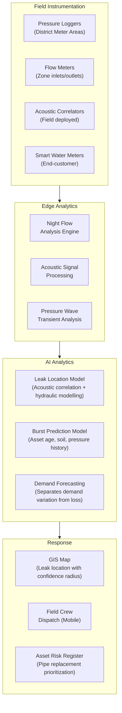
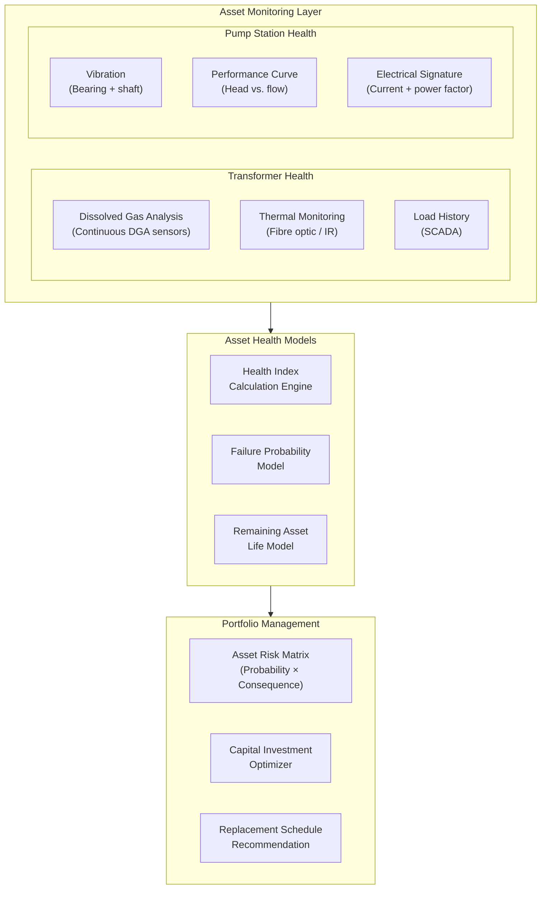

# Utility Sector Use Cases

## Overview

Utility companies — water, electricity distribution, gas networks — operate assets that are critical to public health, safety, and economic activity. They face unique AI challenges: geographically dispersed assets, aging infrastructure, regulatory scrutiny, and the safety consequences of failure. The Industrial Data Backbone provides the foundation to address these challenges at scale.

---

## Leak Detection

### Business Problem

Water utilities globally lose 30–40% of treated water to leakage in distribution networks. Gas distribution operators face similar challenges with network integrity. Leaks cause:

- Revenue loss (non-revenue water / unaccounted gas)
- Infrastructure damage and ground subsidence
- Customer service disruptions
- Safety risks (gas leaks)
- Environmental impact (contamination, greenhouse gas emissions)

Traditional leak detection relies on night flow analysis and manual inspection — reactive, imprecise, and expensive.

### Business Value

| Metric | Typical Improvement |
|--------|-------------------|
| Non-revenue water reduction | 15–25% |
| Leak detection time | From weeks to hours |
| Infrastructure damage prevention | 40–60% fewer burst events |
| Field crew efficiency | +30% (fewer reactive callouts) |
| Regulatory compliance | Improved loss reporting accuracy |

### Data Requirements

| Source | Data Type | Frequency |
|--------|-----------|-----------|
| Pressure transducers | Pressure (bar/psi) | 15-second intervals |
| Flow meters | Flow rate (m³/hr) | 15-second intervals |
| Acoustic sensors | Acoustic emissions | Continuous (edge processed) |
| SCADA | Valve positions, pump states | 1-minute intervals |
| GIS | Pipe material, age, diameter | Static (updated quarterly) |
| Repair history | Past leak locations, pipe failure records | Historical |
| Weather | Rainfall, temperature (affects demand and ground movement) | Hourly |

### Architecture Pattern



### Use Case: District Metered Area (DMA) Leak Detection

**Approach:**
1. Deploy pressure sensors at DMA inlet and outlet points
2. Connect via cellular LPWAN (NB-IoT / LTE-M) to cloud data platform
3. Apply minimum night flow analysis (2–4 AM baseline) to detect step changes indicating new leaks
4. Apply pressure transient analysis to detect pipe bursts in real time (< 5-minute detection)
5. Use AI models trained on repair history and GIS data to predict most likely leak location within 50-meter accuracy
6. Dispatch field crew with mobile app showing probability heat map

**Result:** Reduction in time from leak occurrence to repair from 72+ hours to < 8 hours average.

---

## Asset Health Monitoring

### Business Problem

Utility infrastructure — transformers, pumping stations, treatment plants, compressor stations — is aging. The cost of replacing all aging assets simultaneously is prohibitive. Without AI-driven asset health insight, utilities either over-invest in premature replacement or accept the risk of catastrophic failure.

AI-driven asset health monitoring enables condition-based replacement planning: replace assets when their condition warrants it, not when the calendar says to.

### Business Value

| Metric | Typical Improvement |
|--------|-------------------|
| Asset life extension | 15–25% additional service life |
| Capital deferral | 10–20% reduction in near-term capex |
| Unplanned failure reduction | 35–55% |
| Maintenance cost reduction | 20–30% |
| Insurance premium reduction | 5–15% (demonstrated risk management) |

### Data Requirements

| Asset Class | Key Sensors | AI-Relevant History |
|-------------|------------|---------------------|
| Power transformers | DGA (dissolved gas analysis), temperature, load history | Failure history, inspection records |
| Pumping stations | Vibration, current, pressure, flow | Work order history, performance tests |
| Water treatment | Chemical dosing, turbidity, pH, UV transmittance | Quality records, maintenance history |
| Overhead lines | Sag sensors, corona detection, thermal imaging | Historical faults, inspection reports |
| Cables (HV/MV) | Partial discharge monitoring, thermal | Cable testing results, fault records |

### Architecture Pattern



### Health Index Methodology

The Health Index (HI) is a 0–100 score that aggregates multiple condition indicators into a single asset health value:

```
HI = Σ (Wᵢ × Sᵢ)

Where:
  Wᵢ = weight of condition indicator i (based on criticality and reliability)
  Sᵢ = normalized score for condition indicator i (0–100)

Example (Power Transformer):
  DGA score (30%): 85 → 25.5
  Thermal score (25%): 72 → 18.0
  Load history score (20%): 90 → 18.0
  Age score (15%): 60 → 9.0
  Inspection score (10%): 80 → 8.0
  Total HI: 78.5 (Good condition, continue monitoring)
```

---

## Workforce Intelligence

### Business Problem

Utility field workforces face a perfect storm of challenges: an aging workforce approaching retirement (taking decades of tacit knowledge with them), increasing operational complexity, remote asset locations, and growing service demand. Traditional workforce management — paper-based work orders, experience-based dispatching, reactive scheduling — cannot scale to meet these challenges.

AI-powered Workforce Intelligence optimizes technician dispatch, captures and transfers tacit knowledge, and augments field workers with real-time AI guidance.

### Business Value

| Metric | Typical Improvement |
|--------|-------------------|
| Field crew productivity | +15–25% (fewer repeat visits, better preparation) |
| First-time fix rate | +20–30% |
| Travel cost reduction | 10–20% (optimized routing and dispatching) |
| Knowledge retention | Captured via AI-assisted knowledge base |
| Training time for new technicians | –30–40% (AI guidance accelerates learning) |

### Use Case: AI-Augmented Field Technician

**Problem:** A newly qualified technician is dispatched to a pumping station reporting an unusual vibration alarm. Without years of experience, they may struggle to diagnose the root cause, risking incorrect repair or extended downtime.

**AI Solution:**

```mermaid
sequenceDiagram
    participant TECH as Field Technician (Mobile)
    participant APP as iEdgeX Field App
    participant KG as Knowledge Graph
    participant HIST as Process Historian
    participant LLM as Industrial LLM

    TECH->>APP: Opens work order: PUMP-07 vibration alarm
    APP->>HIST: Query: PUMP-07 sensor data last 7 days
    APP->>KG: Query: PUMP-07 failure history, failure modes
    APP->>LLM: "Vibration alarm on PUMP-07. Historical context: [data]. What is most likely cause and diagnosis steps?"
    LLM->>APP: Most likely: bearing failure (80% confidence)\nBased on: 3 similar events in 2019, 2021, 2022\nDiagnosis steps: 1. Check bearing temp\n2. Take vibration spectrum\n3. Compare to baseline
    APP->>TECH: Display: Probable cause + step-by-step guide + photos from previous repair
    TECH->>APP: Confirms bearing issue; requests parts
    APP->>CMMS: Auto-create parts request (bearing 6308-2RS)
    TECH->>APP: Repair complete + notes entered
    APP->>KG: Update: New repair record linked to failure mode
```

**Key capabilities:**
- Work order briefing — before arrival, technician receives AI-generated summary of asset history, recent alarms, and most likely fault
- Real-time diagnostic guidance — step-by-step troubleshooting based on observed symptoms
- Parts prediction — AI pre-orders likely parts before dispatch
- Knowledge capture — repair notes automatically structured and linked to knowledge graph
- AR overlay — future integration with augmented reality headsets for hands-free guidance

---

## Related Documents

- [Manufacturing Use Cases](manufacturing-use-cases.md)
- [Oil & Gas Use Cases](oil-gas-use-cases.md)
- [Agent Fabric Architecture](../docs/agent-fabric-architecture.md)
- [Industrial Knowledge Graph](../docs/industrial-knowledge-graph.md)
